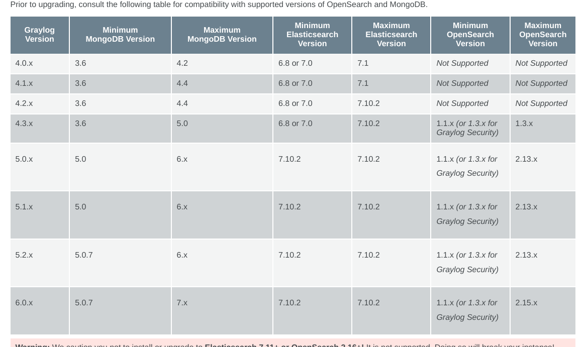

## Backup Data
1. **MongoDB Backup**: Use `mongodump` to back up the MongoDB data.
2. **Elasticsearch Backup**: Back up Elasticsearch data
3. **Graylog Configuration Backup**: Backup Graylog configuration and Helm `values.yaml`.

## Review Breaking Changes
1. **Plugins**: Verify all plugins for compatibility with Graylog `6.x` and replace/remove incompatible plugins.
2. **Templates**: Review any custom templates and ensure compatibility with **JMTE 7.0.2**.

---

## Steps for the Upgrade:

1. **Check Compatibility Matrix**: Review the compatibility matrix of Graylog and MongoDB from the official documentation:

1. **Upgrade MongoDB Operator**: Upgrade the MongoDB operator to the latest version **0.11.0**. Ensure the Helm charts are up to date with the upstream repository.

2. **Remove Incompatible Plugins**: Remove or replace any incompatible Graylog plugins.

3. **Add `data_dir` to Graylog Configuration**:
   Add the `data_dir` in the `graylog.conf` (default: `/usr/share/graylog/data`) based on the values from the `values.yaml` file.

4. **Add Startup Probe for Graylog**:
   Configure a **startup probe** in the Graylog deployment to ensure Graylog starts only after MongoDB is ready.

5. **Upgrade Graylog and MongoDB**:
   Perform the upgrade of Graylog to version **6.0.5** and MongoDB to version **6.0.16** and sync.