# Keycloak Server Setup

NOTE: Do not give admin password from the webUI, add the password via an ENV variable. 'KEYCLOAK_PASSWORD'

* There are bunch of ways to do this, I have did it in this way.

```bash
# Regular way
kubectl create secret generic keycloak-admin --from-file=KEYCLOAK_PASSWORD=./keycloak_password -n keycloak

# Sealed Secret way
kubectl create secret generic keycloak-admin -n keycloak --dry-run=client --from-file=KEYCLOAK_PASSWORD=./keycloak_password -o json >mysecret.json
kubeseal --controller-name sealed-secrets --controller-namespace system <mysecret.json >keycloak-admin.json
```

## Keycloak Client Setup

### Install krew plugin manager

<https://krew.sigs.k8s.io/docs/user-guide/setup/install/>

In case you are interested.
<https://krew.sigs.k8s.io/docs/user-guide/quickstart>

```sh
(
  set -x; cd "$(mktemp -d)" &&
  OS="$(uname | tr '[:upper:]' '[:lower:]')" &&
  ARCH="$(uname -m | sed -e 's/x86_64/amd64/' -e 's/\(arm\)\(64\)\?.*/\1\2/' -e 's/aarch64$/arm64/')" &&
  curl -fsSLO "https://github.com/kubernetes-sigs/krew/releases/latest/download/krew.tar.gz" &&
  tar zxvf krew.tar.gz &&
  KREW=./krew-"${OS}_${ARCH}" &&
  "$KREW" install krew
)
```

Change your shell init scripts to amend `PATH`:

```sh
export PATH="${KREW_ROOT:-$HOME/.krew}/bin:$PATH"
```

## Install the oidc-login client

```sh
kubectl krew install oidc-login
```

Details about setup if you are interested:

* <https://github.com/int128/kubelogin/blob/master/docs/setup.md>

## Basic Keycloak setup

* Log into the keycloak server as admin: <https://keycloak.example.com/auth/admin/>
  * The password can be extracted from the `keycloak-admin` secret.
* Make sure that you are in the `Master` realm
* Create a personal admin user account
  * Manage -> Users -> Add user
  * Fill out `Username`, `Email`, `First name` and `Last name`
  * Email Verified: `On`
  * Click `save`
  * Give the user admin rights
    * Role mappings -> Available Roles -> `admin` -> Add selected
* Set a password for you personal admin account
  * Click `Credentials`
  * Enter your unique password in both fields
  * Temporary: `Off`
  * Click `Set Password`

* Create a new realm
  * Skip this if the `<customer_name>` realm already exists
  * Move the pointer to the `Master  ∨` in the top left corner, and click `Add realm`
  * Name: `<customer_name>`  - without any " " character

## Setup Keycloak with Google as it's identity provider

* Log into the keycloak server, using your personal admin account
* Switch to the `<customer_name>` realm
* Follow this description:
  * <https://access.redhat.com/documentation/en-us/red_hat_single_sign-on/7.3/html/server_administration_guide/identity_broker#google>
    * There is a backup of the documentation [here](static/GoogleSetup.pdf).
  * Google project name: `Keycloak`
  * Hint: Enable `Trust Email`
* Create roles: Configure -> Roles -> Add Role
  * Create `kube_admin` role
  * Create `kube_developer` role
  * *ToDo*: Add more user roles
* Create groups, and their role mappings
  * Manage -> Groups -> New
  * Create `SRE` group, with role mappings to `kube_admin`
  * Create `Developer` group, with role mappings to `kube_developer`
  * *ToDo*: Add more user groups

## Setup Keycloak with Azure AD as it's identity provider

* Configure Azure App Registration
  1.  Create an App Registration in Azure AD:
      - Navigate to Azure AD and create a new app registration

      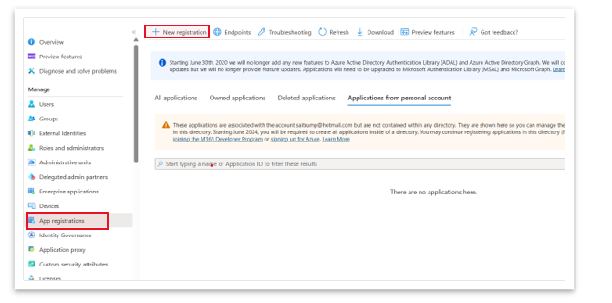
      - Register Keycloak as an Application in Azure AD

      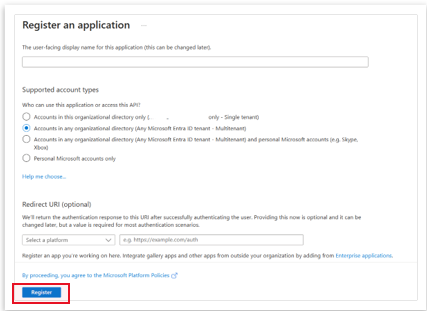
      - Save the Client ID and Client Secret from Azure AD. This information will be needed later in Keycloak.
  2. Obtain Client ID and Client Secret
      - After the registration is complete, go to the app's overview page and copy the "Application (client) ID".
      - Navigate to "Certificates & secrets" and create a new client secret. Copy the value of the client
        secret as it will not be shown again.

      
  3. Configure API Permissions:
      - Go to "API permissions" and add the required Microsoft Graph API permissions. Typically, you need
        `User.Read` and `openid`, `profile`, and `email` permissions.

      

      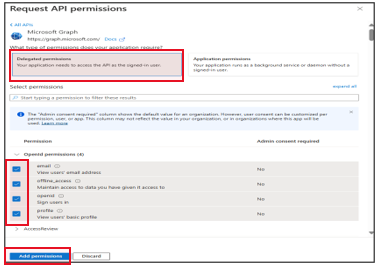
  4. On click Add a permission, the above similar pane will be displayed as shown and you will click on Add
      permission. Then, after Add permission, you will have similar configuration to the below image.

      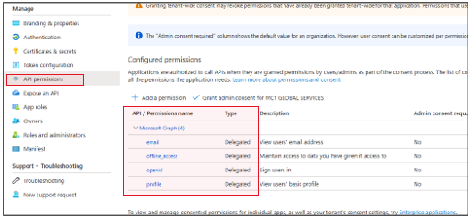
  5. First, let’s create a realm for this purpose and choose after the realm is selected.
    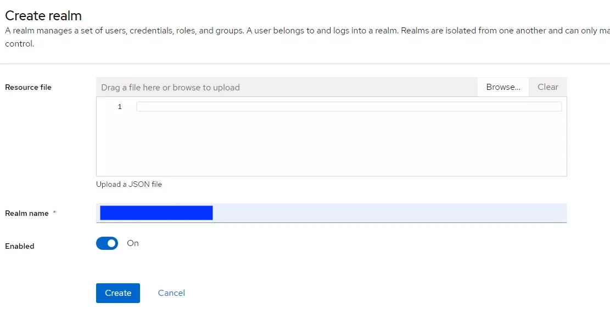
  6. Next, we are going to create the OpenID Connect configuration with the Azure App Registration details already created above.
    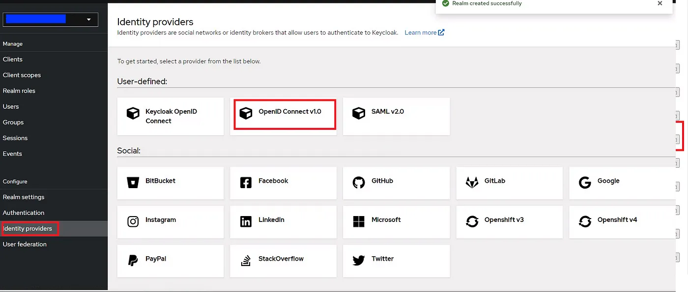
    - In the detail page, fill out the details as required below:
    * Enter the alias of your choice.Enable Use discovery endpoint, if not already enabled
    * Input the Discovery URL from Azure (copied before) into the Discovery endpoint
    * Input the Client ID. This is the application (client) ID copied from Azure app registration.
    * Input Client Secret. This is the application secret copied from Azure app registration
    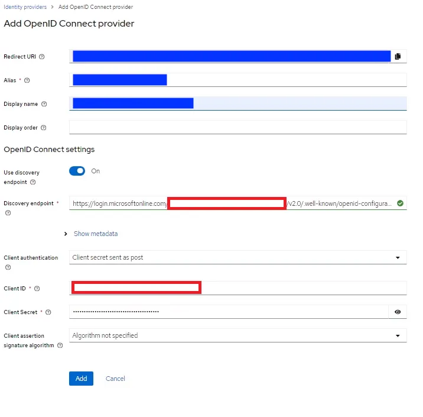
    - Next, copy the redirect URL. This needs to be updated in the Azure app registration.
    - Go back to the Azure registered app, and click “Add a Redirect URL” → “Add a platform” →
      “Web”. Input the redirect URL in the required field and click Configure.
    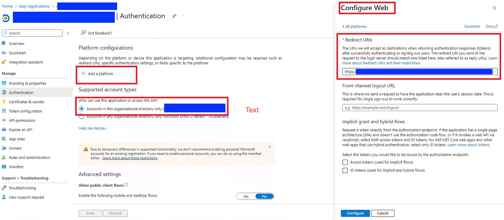
    - To make sure, this integration works, we need to see whether the default account URL redirects to Azure AD SSO as we configured.
      For this, go to Keycloak interface, choose your realm and go to “Clients” from the left panel and click on “account-console”.
    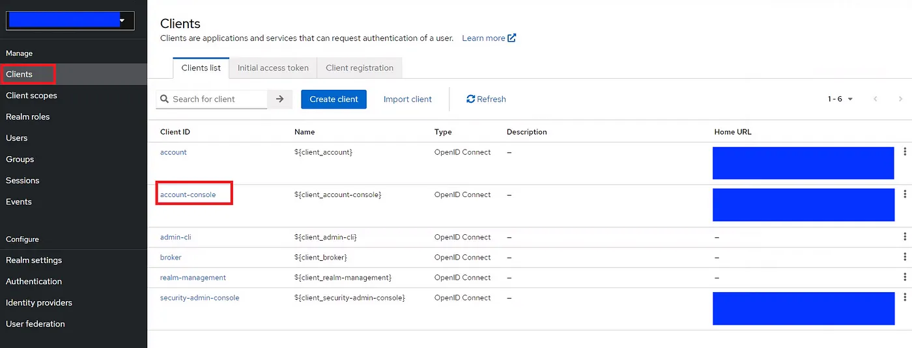
    - Click on Settings tab
      * for “Valid Redirect URIs”, fill the appropriate redirect URI for your UI app
      * for “Web origins”, fill * for all origins (for production, use private secured client network)
      * click Save.
    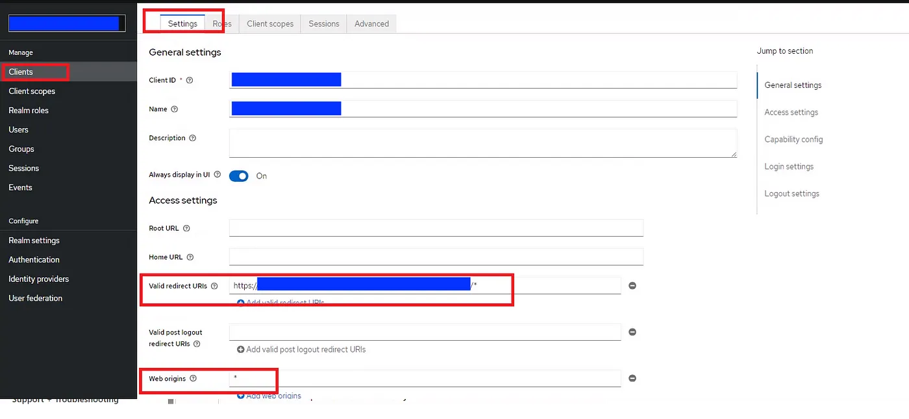

## Setup Keycloak as Identity Provider on a Keycloak

* Log into the keycloak server, using your personal admin account
* Switch to the `<customer_name>` realm
* Click on Identity Provider -> Add provider -> Keycloak OIDC
* Set the alias and displayname
* Set the `Authorization Url` as `https://keycloakx.kam.obmondo.com/auth/realms/Obmondo/protocol/openid-account/auth`
* Set the `Token Url` as `https://keycloakx.kam.obmondo.com/auth/realms/Obmondo/protocol/openid-account/token`
* Set the `Client Authentication` as `Client secret sent as basic auth`
* Set the `Client ID` as `kubeaid-employee`
* Set the `Client Secret` as `secret-from-obmondo`
* Toggle the `pass login hint`
* Save

## Allow Group from external Identity provider to mapper with local keycloak

* Select the relevant realm
* Select the external Identity Provider (You want groups from this ID to map with local groups)
* Select Mappers from the tabs
* Click on "Add mapper" [here](static/identity_provider_mapper.png)
* Add a [local group](static/create_local_group.png), Make sure the group name is same with the external ID.
* Add a mapper on the client.
  * Select the relevant client, for example (argocd)
  * Click on Client Scope
  * Click on 'argocd-dedicated' (this is created by keycloak for you automatically)
  * Click on 'Add mapper' and 'By configuration'
  * Fill in the name and 'Token Claim Name' [here](static/mapper.png)
* Save

## Setup the Kubernetes client

* Log into the keycloak server using your personal admin user
* Go to the `<customer_name>` realm
* Go to clients and click on `Create`.
* Provide the `Client ID` as `kubernetes`, leave `Client Protocol` as
  `openid-connect`, `Root URL` as blank, and click on save.
* In the "Kubernetes" client details find "Valid redirect URLs" and add
  `http://localhost` and click "Save.
* Enable Role/Group membership to be included in the tokens
  * Mappers -> Add Builtin
  * Enable `groups` checkbox
  * Click `Add selected`

## Make logins easier for the user

Since we only allow users to login to the `<customer_name>` using Google oauth,
we can make the login flow faster, by setting it as default:

* Log into the keycloak server using your personal admin user
* Go to the `<customer_name>` realm
* Configure -> Authentication -> Flows -> Browser -> Identity Provider Redirector -> Actions -> Config
  * Alias: `google`
  * Default Identity Provider: `google`

## Add normal users to the Keycloak setup

* Have the user access <https://keycloak.example.com/auth/realms/<customer_name>/account/>
  * Click `Personal Info` link
  * The user is now done, and the basic user account has been created
* Add the user to the group, that that describe their access needs
  * Log into the keycloak server using your personal admin user
  * Go to the `<customer_name>` realm
  * Manage -> Users -> View all users
  * Clik `edit`, on the row describing the user
  * Groups -> Available groups
  * Clik the group where the user belong, and click `join`

## Configure Keycloak to send e-mail

* Extract SMTP username and password from Terraform state
  * The account has been created by terraform, as part of the cluster install procedure
  * Go to the directory, where you have checked out the `iac_iam` repository
  * Execute: ```terraform refresh```
  * Execute:

    ```sh
    terraform show -json | jq -e '.values.root_module.child_modules[].resources[] | select(.name=="keycloak-smtp") | select(.type=="aws_iam_access_key")|{cluster:.index,smtp_user:.values.id,smtp_pass:.values.ses_smtp_password_v4}'
    ```

* Log into the keycloak server using your personal admin user
* Go to the `<customer_name>` realm
* Configure -> "Realm Settings" -> Email
  * Host: `email-smtp.eu-west-1.amazonaws.com`
  * Port: `587`
  * From Display Name: `<Customer Name> Keycloak`
  * From: `info@<customer_name>.com`
  * Envelope From: `info@<customer_name>.com`
  * Enable StartTLS: `On`
  * Enable Authentication: `On`
  * Username: &lt;*Extracted from Terraform state*&gt;
  * Password: &lt;*Extracted from Terraform state*&gt;
* Click `Test conection`
  * This has to succeed!
* Click `Save`

## Setup the client

* Run the below

    ```sh
    export KEYCLOAK_URL="https://keycloak.your.domain.com/auth/realms/master"
    export CLIENT_ID=kubernetes
    export CLIENT_SECRET=kubernetes

    kubectl oidc-login setup --oidc-issuer-url=$KEYCLOAK_URL --oidc-client-id=$CLIENT_ID --oidc-client-secret=$CLIENT_SECRET
    ```

* Bind a cluster role
  1. After you ran the above command, you would be getting a output which will include the below command,
     just correct the clusterrolebinding `name` here.
  2. The url should be exactly same from the output of the above command.

        ```sh
        kubectl create clusterrolebinding <your-username>-oidc-cluster-admin --clusterrole=cluster-admin --user='$KEYCLOAK_URL#<your-keycloak-userID>'
        ```

* Set up the Kubernetes API server. Add the following options to the kube-apiserver:

    ```raw
    --oidc-issuer-url=$KEYCLOAK_URL
    --oidc-client-id=$CLIENT_ID
    ```

    > k8s admin should have already done it via puppet/kops (get it confirmed by the k8s admin)

* Set up the kubeconfig

  1. Run the following command to add the oidc user in your `kubeconfig` file.

      ```bash
      kubectl config set-credentials oidc \
        --exec-api-version=client.authentication.k8s.io/v1beta1 \
        --exec-command=kubectl \
        --exec-arg=oidc-login \
        --exec-arg=get-token \
        --exec-arg=--oidc-issuer-url=$KEYCLOAK_URL \
        --exec-arg=--oidc-client-id=$CLIENT_ID \
        --exec-arg=--oidc-client-secret=$CLIENT_SECRET
      ```

  2. Or directly copy below in your `kubeconfig` file.

      ```yaml
      users:
      - name: oidc
        user:
          exec:
            apiVersion: client.authentication.k8s.io/v1beta1
            args:
            - oidc-login
            - get-token
            - --oidc-issuer-url=$KEYCLOAK_URL
            - --oidc-client-id=$CLIENT_ID
            - --oidc-client-secret=$CLIENT_SECRET
            command: kubectl
            env: null
            provideClusterInfo: false
      ```

  3. Once done set the `oidc` user for current context.

      ```bash
      kubectl config set-context --user oidc $(kubectl config get-contexts -o name)
      ```

* Verify cluster access

  ```bash
  kubectl get nodes
  ```

## Create Keycloak Group based Cluster RBAC autherization

* Login to keycloak as admin

* Go to your client(kubernetes in this case)

* In your client go to `mappers` & click on `create`

* Create a new mapper as shown below:

  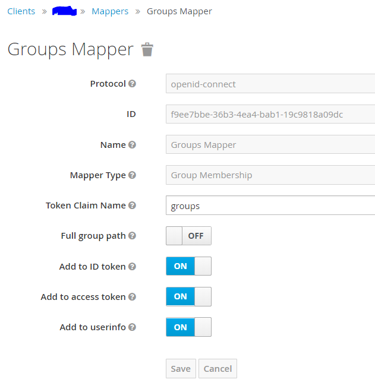

* Once done, you can go ahead create all the respective groups you want in keycloak.
  1. From [Keycloak homepage](https://keycloak.your.domain.com/auth/admin/master/console/)
     go to [groups](https://keycloak.your.domain.com/auth/admin/master/console/#/realms/master/groups) and click on `new`
  2. Provide the new group's name and click save.

* Add the users to the group
  1. From [Keycloak homepage](https://keycloak.your.domain.com/auth/admin/master/console/)
     go to [users](https://keycloak.your.domain.com/auth/admin/master/console/#/realms/master/users)
     and click on `View all users`
  2. Go `Groups`
  3. Select the group you want to add the user to from the `Available Groups` table
  4. Click on `Join`

* Create the respective RBAC policy in kubernetes cluster

    ```yaml
    apiVersion: rbac.authorization.k8s.io/v1
    kind: ClusterRoleBinding
    metadata:
      name: sre-admin
    subjects:
    - kind: Group
      name: <Keycloak groups name>
      apiGroup: rbac.authorization.k8s.io
    roleRef:
      kind: ClusterRole
      name: <clusterRole name that you want to map the group to>
      apiGroup: rbac.authorization.k8s.io
    ```

* Refresh your `id-token` retrived from keycloak and you are good to go.

---

## Add user in keycloak

* Select realm 'master'

    NOTE: `master` realm is sacred, so add user wisely in this realm and
    for other purpose just use another realm (most of the cases there will be `devops` realm)
* From [Keycloak homepage](https://keycloak.your.domain.com/auth/admin/master/console/)
  go to [users](https://keycloak.your.domain.com/auth/admin/master/console/#/realms/master/users) i
  and click on `View all users`
* Click on `Add User`
* Add the relevant details and under `Required User Actions` add `Update Password` (so user can change password on login)
* Click on `Save`
* Click on `Credentials` and give the random password and share it with the end user, make sure `Temporary` is **ON**
* Click on `Role Mappings` and under `Available Roles` select `admin` and
  click on `Add Selected` (it automatically saves and you should see green colour popup alert toolbox)

  NOTE: `admin` role is quite powerful, so be cautious about this when assigning this role and
  its only available in `master` realm

## Keycloak custom login page

* Create a new folder, named login, inside the `themes/custom` directory. To keep things simple, we’ll first copy all
  the contents of the
    [themes/keycloak/login](https://github.com/keycloak/keycloak/tree/main/themes/src/main/resources/theme/keycloak/login)
     directory.
* Change `login/resources/img/keycloak-logo-text.png` to your own logo.
* For more customizations refer [here](https://www.keycloak.org/docs/latest/server_development/index.html#creating-a-theme)
* Build and push the image to any image registry.
* In the value files add the following

  ```yaml
          extraInitContainers: |
            - name: custom-theme-provider
              image: <image>
              imagePullPolicy: IfNotPresent
              command:
                - sh
              args:
                - -c
                - |
                  echo "Copying theme..."
                  cp -R /custom/* /theme
              volumeMounts:
                - name: theme
                  mountPath: /theme
          extraVolumeMounts: |
            - name: theme
              mountPath: /opt/keycloak/themes/bw7
          extraVolumes: |
            - name: theme
              emptyDir: {}
  ```

* Apply the changes and you should see the custom login page.

## Troubleshooting

* Remove all cache session and run all the steps in the Setup the client.

  ```bash
  # rm -fr ~/.kube/cache/oidc-login

  # kubectl delete clusterrolebinding <your-username>-oidc-cluster-admin
  ```

## Disaster Recovery

The keycloak recovery/reconfiguration can also be done by exporting the realm and later importing it. Steps:

* Login to keycloack as admin
* Go to `https://<keycloack-url>/auth/admin/master/console/#/realms/master/partial-export`
* `Export groups and roles` -> ON
* `clients` -> ON
* Click on `Export`

This will download the real and the respective settings as a `.json` file which can later be used to import the
settings from `https://<keycloack-url>/auth/admin/master/console/#/realms/master/partial-import`.

The same can also be done through the argocd UI. You can go ahead and delete the app from the argocd UI,
which doesn't seem to delete the PVC/PV, therefore when you sync the root app and i
the keycloak app next it will use the same PVC/PV.

Restoring itself to the point previously setup and configured to.

## Migrating Keycloak from Zalando to CNPG

Keycloak has its configuration in a pgsql database. Taking a backup of the `keycloak` database is sufficient to restore
the state of an existing Keycloak.

These steps will cause a downtime for your keycloak instance, please request appropriate service windows
and have backups at hand to revert back to a stable version.

Steps:

1) Point the keycloak helm chart to a feature branch or the latest tag of Kubeaid repo from ArgoCD that enables the cnpg cluster resource.
    Please remember that you might need to edit your values.yaml file to disable the zalando pgsql from getting created.
2) Sync the `kind: Cluster` resource from the ArgoCD UI. This is the destination postgres db, and it will be completely clean.
3) Don't sync the Keycloak StatefulSet for now.
4) Take a shell into the existing zalando pgsql pod, and take a pgdump of `keycloak` database
    ```
    pg_dump -d keycloak -U keycloak -f keycloak_db.dump
    ```
5) Copy the dump from the zalando pgsql pod to your local machine.
6) Copy the dump from the local machine to your destination cnpg pod.
7) Take a shell into the cnpg pod and import the dump
    ```
    psql -d keycloak < keycloak_db.dump
    ```
8) Sync the Keycloak statefulset from ArgoCD UI and wait for a while for the migrations to be completed.
9) Your keycloak instance will be migrated to the new pgsql db and should become healthy in a while.

## Good "Reads"

* <https://medium.com/keycloak/github-as-identity-provider-in-keyclaok-dca95a9d80ca>
* <https://www.youtube.com/watch?v=duawSV69LDI>
* <https://medium.com/keycloak/keycloak-as-an-identity-broker-an-identity-provider-af1b150ea94>
* <https://www.postgresql.org/docs/current/backup-dump.html#BACKUP-DUMP-RESTORE>