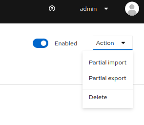
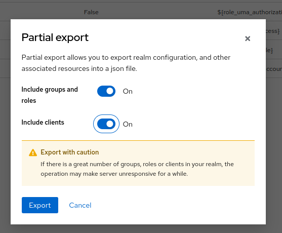

# Keycloak Upgrade Guide

This document provides instructions for upgrading Keycloak instance. Follow these steps to ensure smooth operations.

---

## Prerequisites

1. **Backup Data**:
   - Backup the Keycloak database by running the cronjob.

    ```sh
    kubectl create job --from=cronjob/logical-backup-keycloakx-pgsql logical-backup-trigger -n keycloakx
    ```

   - Export the keycloak config by loggin in as `admin` user .

    - Port forward the keycloak `kubectl port-forward pod/keycloakx-0 8080:8080 -n keycloakx`
    - Open `http://localhost:8080/auth/`
    - Get the `admin` user password `kubectl get secret keycloak-admin -n keycloakx -o jsonpath="{.data.KEYCLOAK_PASSWORD}" | base64 --decode`
    - Login as admin and select the desired realm and go to realm setting and from top right.

        
    - select partial export and include groups roles and client and save the data locally, and do this for all the realms.

        

2. **Check Compatibility**:
   - Verify the compatibility of the new version with your database and custom extensions.
   - Review the [Keycloak Release Notes](https://www.keycloak.org/docs/latest/release_notes/index.html) for breaking changes.

3. **Ensure Downtime**:
   - Schedule a service window as the service will be unavailable during the upgrade.


# Debug guide

- Check the helm values files to make sure its using the correct version.
