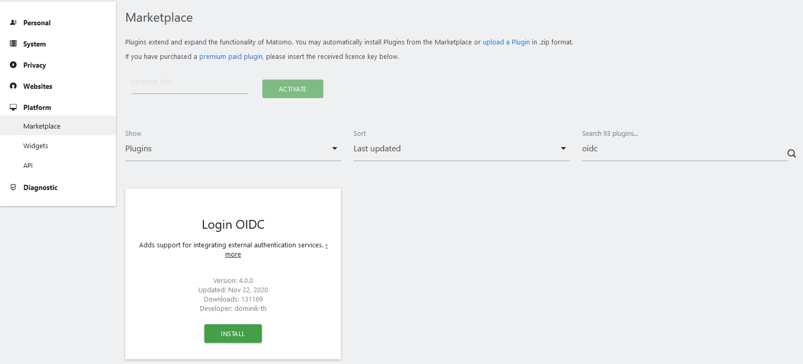
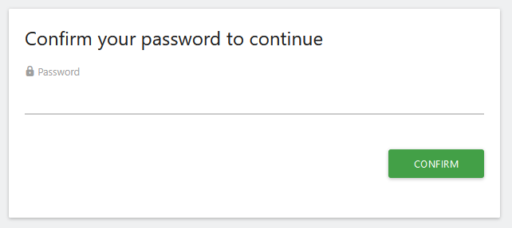
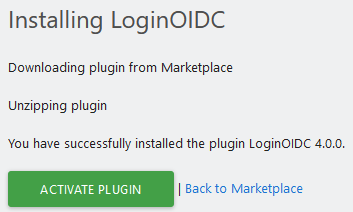
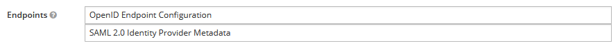
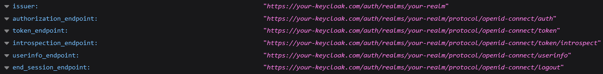
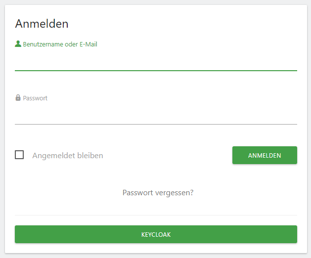
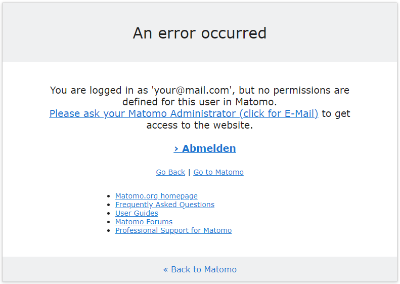

# Matomo Deployment with Operator managed MariaDB

## Setting up keycloak with matomo

### Creating the Keycloak client

Login into the Keycloak UI and select the desired Realm in the Dropdown menu in the top left corner. Then click the Clients menu entry and start the creation with the Create button in the top right corner.

Define the following attributes according to your setup:

- Client ID: matomo
- Access Type: confidential
- Standard Flow Enabled: ON
- Valid Redirect URIs: https://your-matomo.com/index.php?module=LoginOIDC&action=callback&provider=oidc and https://your-matomo.com
- Web Origins: +

After hitting the save Button, make sure you take note of the Client Secret in the Credentials tab. You will need this later during the tutorial.

Installation of the OIDC Plugin
Matomo is highly extensible through the usage of Plugins, which can be found in the Matomo Marketplace: https://plugins.matomo.org. There we also find the needed Plugin to enable OIDC in Matomo: https://plugins.matomo.org/LoginOIDC

Login to Matomo UI and go to the settings menu. From there open the menu entry Marketplace under Platform. Simply search for OIDC to find the desired Plugin.



For security reasons Matomo will ask you for your password again.



The Plugin will be downloaded as zip file and unzipped. If everything completes successful we can activate the Plugin.



You will be prompted with a green banner telling you everything worked as desired.


From here we can go straight to the settings to connect the earlier created Keycloak client to this Matomo installation. You will be redirect the attributes of the Plugin, which can be found under **General Settings --> LoginOIDC.**

### Configuring the OIDC Plugin

We can leave the first settings as they are, with one exception. Make sure you activate the checkbox **Create new users when users try to log in with unknown OIDC accounts**.


You'll need some URLs to specific endpoints of your Keycloak installation. You can find them in the Keycloak UI under **Realm Settings --> Endpoints --> OpenID Endpoint Configuration.**



This will open up a new tab, which contains the required URLs like the authorization, token and userinfo endpoint.



Enter the attributes similar to the following examples:

- Name: Keycloak
- Authorize URL: https://your-keycloak.com/auth/realms/your-realm/protocol/openid-connect/auth
- Token URL: https://your-keycloak.com/auth/realms/your-realm/protocol/openid-connect/token
- Userinfo URL: https://your-keycloak.com/auth/realms/your-realm/protocol/openid-connect/userinfo
- Logout URL: https://your-keycloak.com/auth/realms/your-realm/protocol/openid-connect/logout?redirect_uri=https://your-matomo.com
- Userinfo ID: preferred_username
- Client ID: matomo
- Client Secret: 4gqYXyeOX7lPlk4JTvDStwIipJ8T3mbU
- OAuth Scopes: openid email profile

After defining all the required attributes you will find a new button "Keycloak" on the login screen.



When first loggin in you will probably see an error, stating that you don't have any permissions to access any of the websites inside the Matomo installation. Please ask your Matomo administrator to fix this problem by assigning you some permissions under **System --> Users** in the Matomo Settings.



That's it! You have setup Single Sign-On for Matomo using Keycloak as OIDC Provider.

- source - https://christianhuth.de/using-keycloak-as-oidc-provider/

## Changing access to superuser for multiple users
  
- Matomo currently allows only [one superuser](https://matomo.org/faq/general/faq_69/#:~:text=Users%20with%20'admin'%20permission%20can,plugins%20or%20other%20global%20settings) by default.
- To give superuser access to multiple users, we have to set `superuser_access` in `matomo_user` table in the db:
  - Exec into the mariadb pod
  - Run the following commands -

  ```sql
    mariadb -u root -p$MARIADB_ROOT_PASSWORD
    use <db_name>;
    UPDATE `matomo_user` SET superuser_access = 1 WHERE `login` = 'username-here';
  ```

  - Now the given user should have superuser access which you can verify through the dashboard.
  - Same steps can be used to modify access for any user

  **NOTE** - in the command `mariadb -u root -p$MARIADB_ROOT_PASSWORD`, ensure that there is no space after `-p` flag
