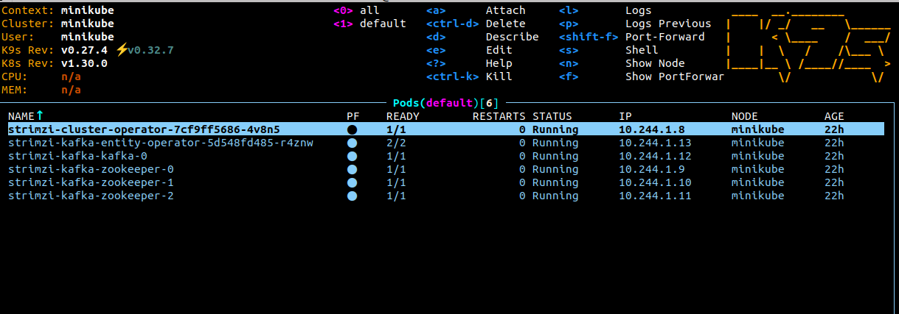
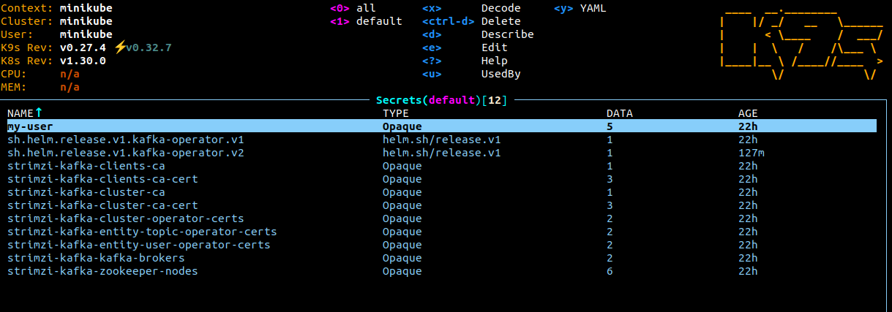

# Strimzi kafka operator

## Setting up the strimzi kafka operator

### Configuration

The current ready-to-go configuration provided in the [values file](./values.yaml) is the default configuration required
to run kafka with tls enabled.

more configuration examples can be found in the [examples folder](./examples/)

### Install

- To install the kafka-operator locally in a cluster(f.ex minikube) go to the chart directory `argocd-helm-charts/strimzi-kafka-operator` and run the below command

```bash
helm install kafka-operator . -n default
```

- Once deployed ensure that all the CRDs (kafka, kafkaUser, kafkaTopic) and ingress(if enabled) are created
- After all the pods are created as shown below



- Verify that the secrets which contain all the necessary certificates including kafka user certificate are created as shown below



## Using confluent kafka go

- These steps are for the config provided in the [default values file](./values.yaml).
- If golang service is running outside the cluster, ensure that the `listener` is not of type `internal` in the config.
- Repository - https://github.com/confluentinc/confluent-kafka-go/

### Producer config -

#### TLS authentication -

```go
p, err := kafka.NewProducer(&kafka.ConfigMap{
        "bootstrap.servers":                     "192.168.49.2:30486",
        "security.protocol":                     "SSL",
        "ssl.endpoint.identification.algorithm": "none",
        "ssl.ca.location":                       "/home/ananth/Desktop/kafka-local/ca/cluster.crt",
        "ssl.certificate.location":              "/home/ananth/Desktop/kafka-local/ca/user.crt",
        "ssl.key.location":                      "/home/ananth/Desktop/kafka-local/ca/user.key",
    })
```

- `ssl.ca.location` - `cluster.crt` certificate can be found in the secret `strimzi-kafka-cluster-ca-cert` (required)
- `ssl.certificate.location` - client certificate stored in secret created for `KafkaUser` (required)
- `ssl.key.location` - client's private key stored in secret created for `KafkaUser` (required)
- `"ssl.endpoint.identification.algorithm": "none"` - for more info - https://github.com/confluentinc/librdkafka/issues/4349#issuecomment-1640196425 (required)
- `security.protocol` - `SSL` (required)
- `bootstrap.servers` - `<internal/external IP>:<port>` (required)

#### SCRAM-SHA-512 authentication -

```go
p, err := kafka.NewProducer(&kafka.ConfigMap{
        "bootstrap.servers": "192.168.49.2:30263",
        "sasl.mechanisms":   "SCRAM-SHA-512",
        "security.protocol": "SASL_PLAINTEXT",
        "sasl.username": "my-user",
        "sasl.password": "UkPeaYQDJSnj1kLKVd96kXh9C60Mf6Uo",
    })
```

- `sasl.password` - password found in the secret created for `KafkaUser` (required)
- `sasl.username` - username of the `KafkaUser` (required)
- `sasl.mechanisms` - `SCRAM-SHA-512` (required)
- `security.protocol` - `SASL_PLAINTEXT` (required)

### Consumer config -

#### TLS authentication -

```go
c, err := kafka.NewConsumer(&kafka.ConfigMap{
        "bootstrap.servers":                     "192.168.49.2:30486",
        "group.id":                              "my-consumer-group",
        "auto.offset.reset":                     "earliest",
        "security.protocol":                     "SSL",
        "ssl.endpoint.identification.algorithm": "none",
        "ssl.ca.location":                       "/home/ananth/Desktop/kafka-local/ca/cluster.crt",
        "ssl.certificate.location":              "/home/ananth/Desktop/kafka-local/ca/user.crt",
        "ssl.key.location":                      "/home/ananth/Desktop/kafka-local/ca/user.key",
    })
```

#### SCRAM-SHA-512 authentication -

```go
c, err := kafka.NewConsumer(&kafka.ConfigMap{
        "bootstrap.servers":                     "192.168.49.2:30486",
        "group.id":                              "my-consumer-group",
        "auto.offset.reset":                     "earliest",
        "sasl.mechanisms":   "SCRAM-SHA-512",
        "security.protocol": "SASL_PLAINTEXT",
        "sasl.username": "my-user",
        "sasl.password": "UkPeaYQDJSnj1kLKVd96kXh9C60Mf6Uo",
    })
```

*NOTE* - Ensure that the `KafkaUser` has the required permissions for the resource group `my-consumer-group`.
