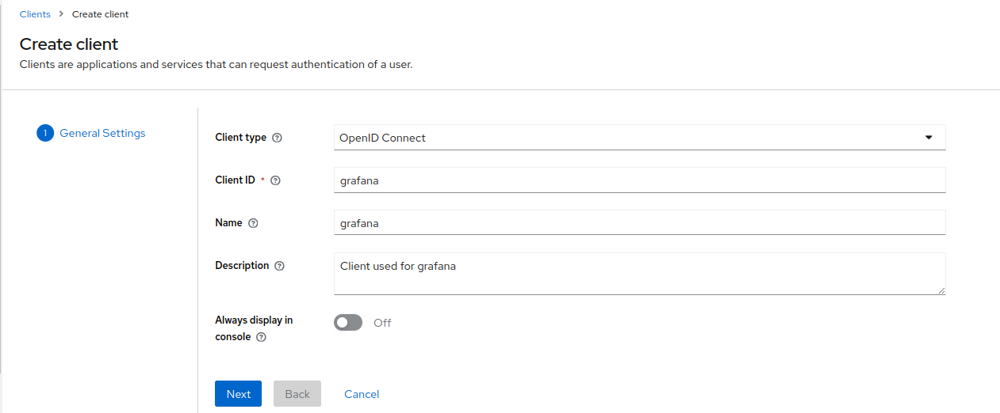
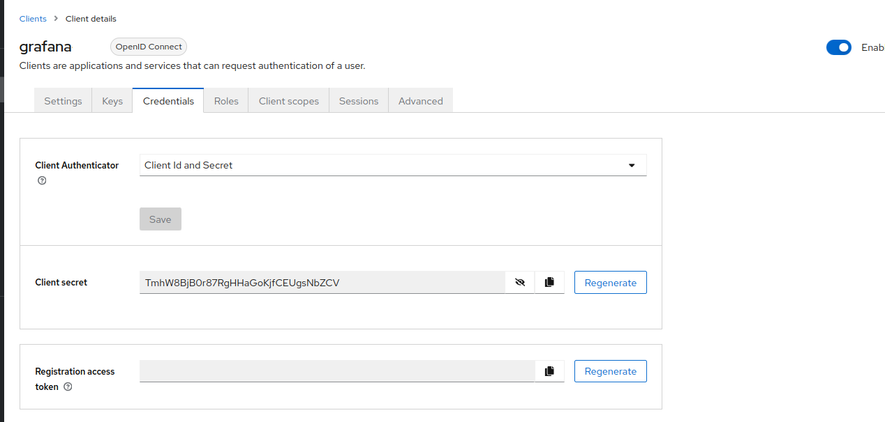
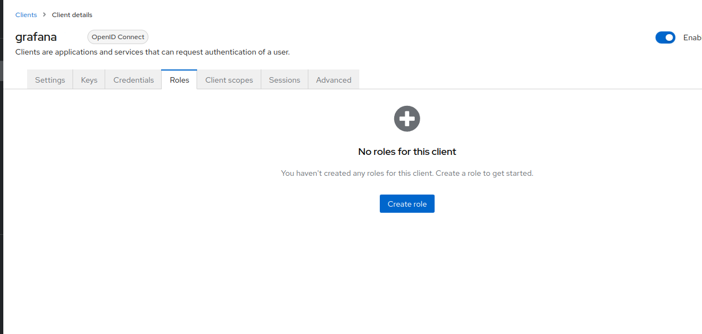
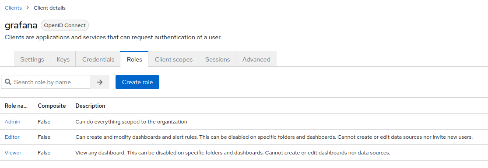
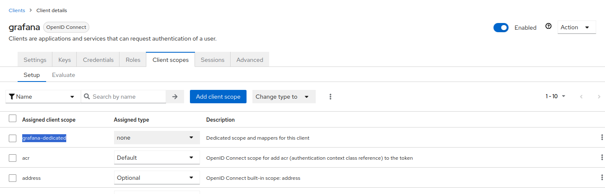
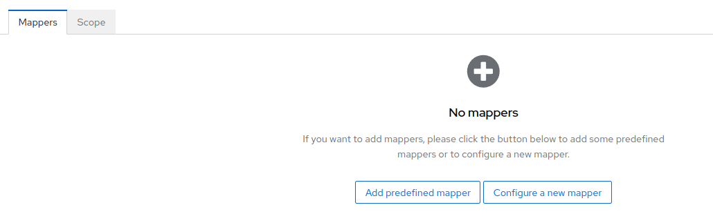
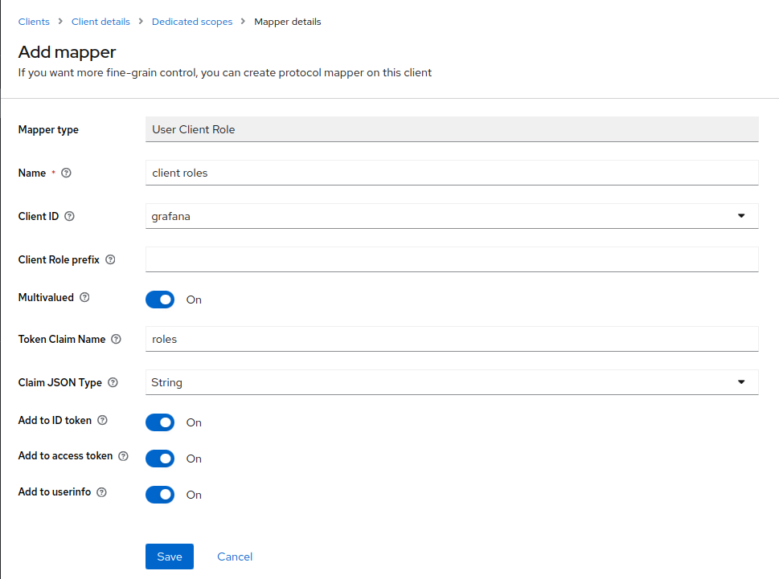
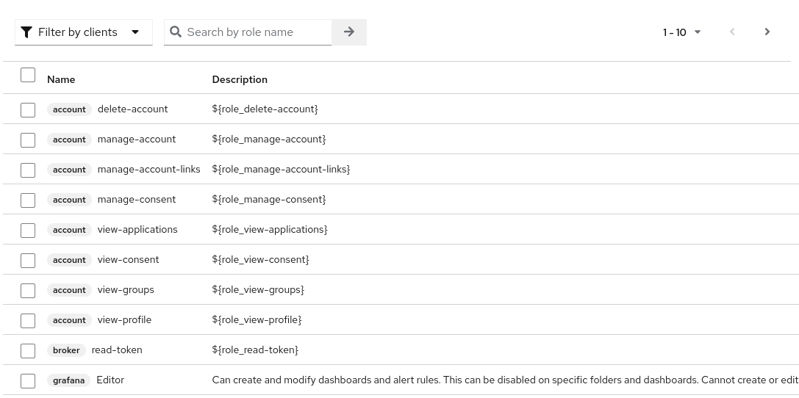

# Prometheus Kubernetes Stack

Includes alertmanager, grafana etc.

## Integrate Keycloak with Grafana

Instead of granting access to your team using separate Grafana user account credentials, try something like Keycloak
which is an Open Source OIDC provider. Your team can login to Grafana using existing OAuth configurations and you can
maintain the RBAC policies per team too.

## steps to configure grafana client with keycloak.

  1. Create client ID of grafana

      
      - Enable Client authentication
      

  2. Create client secret

      
      - Use the token in grafana client secret
  
  3. Create role for the grafana users
    
      
      - Create three roles `Admin`, `Editor`, `Viewer` it will be used by grafana for permission.
      
      

  4. Add Mapper which will be used for roles for grafana users
      
      
      - there will be a scope called `grafana-dedicated`, create the mapper in that.
      
      - Select Configure a new mapper and select `User Client Role`
      
      - set Client ID as `grafana`

  5. Create a user and assign the role to the user
  
      
      - Filter by clients and select the client `grafana<Role>`
* Create secret with the token you get from the grafana client on keycloak

```console
kubectl create secret generic kube-prometheus-stack-grafana -n monitoring --dry-run=client --from-literal=grafana-keycloak-secret=i_love_k8s -o json | kubeseal --controller-name sealed-secrets --controller-namespace system - > sealed-secrets/cluster_name/monitoring/kube-prometheus-stack-grafana.json
```

  
## Activate support from K8id Support team

```bash
# You will get the private key and cert from K8id Support team.

kubectl create secret tls obmondo-clientcert --namespace monitoring --dry-run=client --key=./private.key --cert=./cert.pem --output=yaml | kubeseal --controller-namespace system --controller-name sealed-secrets --format yaml -
```

```bash
# copy the existing template from the example-alertmanager-config dir, the filename is alertmanager-main
cp alertmanager-main-slack.yaml /to/your/k8id-config/k8s/your-cluster/sealed-secret/monitoring/alertmanager-main.yaml

# add your slack url with this command.
kubectl create secret generic alertmanager-main --dry-run=client --from-literal=slack-url="https://hooks.slack.com/services/lol/my/token" -o yaml | kubeseal --controller-namespace system --controller-name sealed-secrets --format yaml --merge-into alertmanager-main.yaml
```

## Troubleshooting

* You have deployed the kube stack and now want to change the password of grafana.

  * You created a sealed secret and pushed it to the git repo and sync'd the secret app in argocd and i
    you can check your password is correct or not in k8s, by this command.

      ```bash
      kubectl get secret  kube-prometheus-stack-grafana -n monitoring -o jsonpath="{.data.admin-password}" | base64 --decode ; echo
      ```

  * The password would be correct, but when you try to login it won't work, why ? cause the stack has already
    deployed the grafana and has no idea how to change the existing password in grafana.

  * To reproduce this, delete the kube stack and run the get secret command and you would see the password is i
    changed to the default one, which it shouldn't.

* Timeout Error while connecting to keycloak

  ```raw
  lvl=eror msg=login.OAuthLogin(NewTransportWithCode) logger=context userId=0 orgId=0 uname= error="Post \"https://keycloak.example.com/auth/realms/devops/protocol/openid-connect/token\": dial tcp 10.2.43.194:443: connect: connection timed out"                                                                                    │
  ```

* Relogin does not work as expected. (Happens randomly)

* Currently when you login and logout and login again (it fails here)
* The second login works (confirmed by looking at the logging session in keycloak)
* FIX:
  * Logout all the session from the keycloak
  * closed the browser (Now I was testing it in 'Private Mode')
  * start a new browser and login again
* Alternate Fix:
  * Open Dev Tools in Browser (`Ctrl` + `Shift` + `I`)
  * Navigate to `Network` Tab
  * Check `Disable cache`
  * Navigate to `Application` Tab
  * Click on `Cookies` in the left pane
  * Delete the cookies.

## References

* [Grafana Docs with Keycloak](https://grafana.com/docs/grafana/next/setup-grafana/configure-security/configure-authentication/keycloak/)
