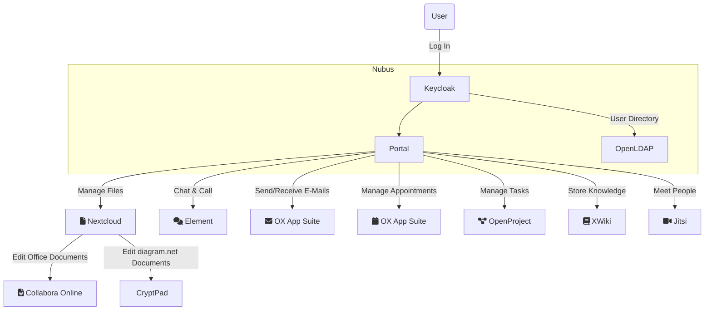
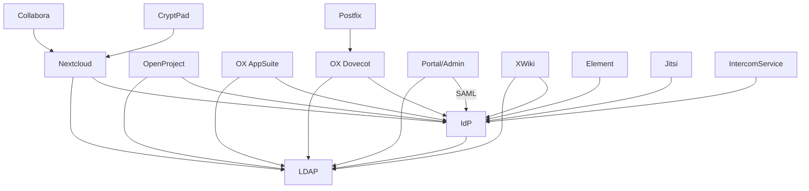
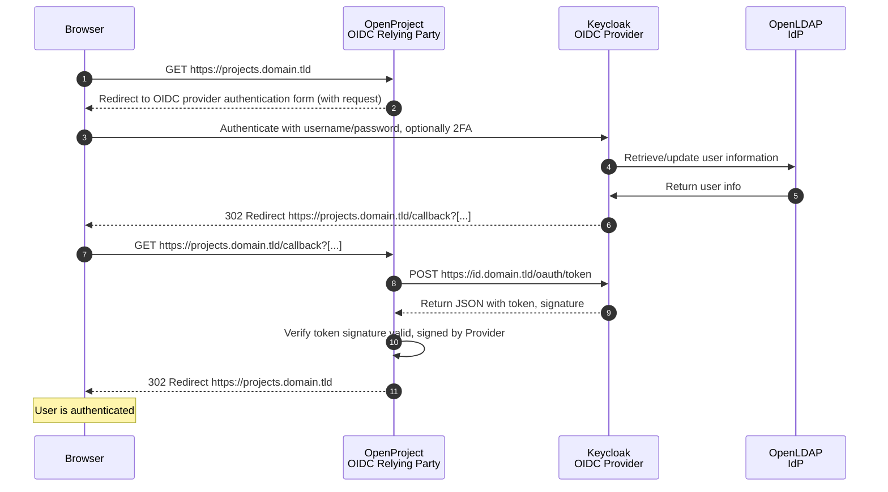
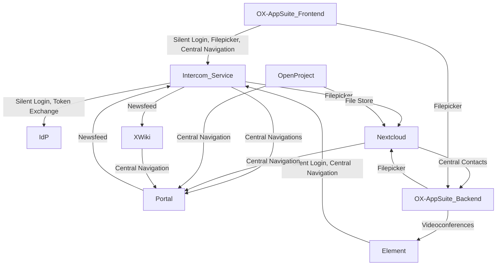

<!--
SPDX-FileCopyrightText: 2024 Zentrum für Digitale Souveränität der Öffentlichen Verwaltung (ZenDiS) GmbH
SPDX-License-Identifier: Apache-2.0
-->

<h1>Architecture</h1>

<!-- TOC -->
* [Overview](#overview)
* [Nubus (IAM)](#nubus-iam)
* [Authentication](#authentication)
  * [Identity data flows](#identity-data-flows)
  * [OpenID Connect (OIDC)](#openid-connect-oidc)
  * [Keycloak](#keycloak)
  * [Keycloak Extensions](#keycloak-extensions)
  * [OpenLDAP](#openldap)
* [Authorization](#authorization)
  * [LDAP Group Synchronization](#ldap-group-synchronization)
* [Provisioning](#provisioning)
  * [OX Connector](#ox-connector)
  * [SCIM](#scim)
* [Component integration](#component-integration)
  * [Intercom Service / Silent Login](#intercom-service--silent-login)
  * [Central Contacts](#central-contacts)
  * [Central Navigation](#central-navigation)
  * [Filepicker](#filepicker)
  * [Newsfeed](#newsfeed)
  * [(OpenProject) File Store](#openproject-file-store)
* [Applications vs. Services](#applications-vs-services)
  * [Collabora (Office)](#collabora-office)
  * [CryptPad Online (Diagrams)](#cryptpad-online-diagrams)
  * [Element/Synapse (Chat \& Call)](#elementsynapse-chat--call)
  * [Jitsi (Video Conferencing)](#jitsi-video-conferencing)
  * [Nextcloud (Files)](#nextcloud-files)
  * [Nubus (Identity and Access Management / Portal)](#nubus-identity-and-access-management--portal)
  * [OpenProject (Project management)](#openproject-project-management)
  * [OX App Suite (Groupware) with OX Dovecot (Mail backend)](#ox-app-suite-groupware-with-ox-dovecot-mail-backend)
  * [XWiki (Knowledge management)](#xwiki-knowledge-management)
* [Application specific user accounts](#application-specific-user-accounts)
* [Footnotes](#footnotes)
<!-- TOC -->

openDesk is designed as a [Kubernetes](https://kubernetes.io) deployment.

It consists of a set of [Helm charts](https://helm.sh/) orchestrated by [Helmfile](https://github.com/helmfile/helmfile).

openDesk includes functional applications, like file management, chat, and email. Other services such
as databases and object storage are included for evaluation purposes only. In production, you must provide
these services yourself.

# Overview

The following diagram shows a high-level overview of openDesk.



openDesk includes a portal that allows navigation to the respective application. The portal is part of the
Identity and Access Management (IAM) application shipped with openDesk: *Nubus*. Nubus includes OpenLDAP
for storing users, groups, and permissions, and Keycloak for single sign-on with LDAP user federation
configured to use the aforementioned OpenLDAP.

When the user is authenticated by Keycloak, the portal shows the applications the user is permitted to access.

The user can now access applications and use the corresponding functionality without the need to authenticate 
again. This is implemented using the OpenID Connect (OIDC) protocol.

# Nubus (IAM)

[Nubus](https://www.univention.de/products/nubus/) is a specialized IAM platform developed by Univention GmbH
to centralize and simplify identity management in IT environments. It is typically used in contexts where
user authentication, role-based access control, and integration with multiple systems are essential.

In openDesk, Nubus serves the following purposes:

1. Identity Provider (IdP)

    Nubus acts as the central IdP in a federated authentication system, issuing and managing authentication tokens for applications.

2. Access Control Layer

    As a gateway, Nubus ensures that only authorized users can access specific systems, services, or APIs, enforcing RBAC policies.

3. Integration Hub

    Links applications by synchronizing identity and access data across them, ensuring consistency.

4. User Provisioning

    Automates the process of creating, updating, and deactivating user accounts across integrated systems based on organizational workflows.

5. IAM Administration

    The user, group and permission information which is stored in Nubus' OpenLDAP service is managed by IAM Admin(s)
    using a stripped down version of the [UMC (Univention Management Console)](https://docs.software-univention.de/manual/5.0/de/central-management-umc/umc.html).

6. Frontend Integration Authentication

    A specialized component - the Intercom Service - acts according to the Backend-for-Frontend pattern when it comes to certain integration use cases, for example, ones that require the frontend of one application to call the API of another service, that also has the need for user authentication. See [Component integration](#component-integration) for more details.

7. Portal

   Nubus provides a Portal component for users to access the connected applications. This component also includes self-service possibilities  e.g. for password resetting.

For additional information, refer to the [Nubus for Kubernetes Architecture Manual](https://docs.software-univention.de/nubus-kubernetes-architecture/latest/en/index.html).

# Authentication

openDesk uses the OpenID Connect (OIDC) protocol for authentication and authorization.

## Identity data flows

An overview of
- components that consume the LDAP service.
  - The components access the LDAP using a component-specific LDAP search account.
- components using Univention Keycloak as an identity provider (IdP).
  - The components should use OAuth2 / OIDC flows if not otherwise denoted.
  - All components have a client configured in Keycloak.

Some components trust others to handle authentication for them.



## OpenID Connect (OIDC)

[OIDC](https://openid.net/developers/how-connect-works/) is an identity layer on top of the OAuth 2.0 protocol, allowing clients (Relying Party (RP)) to verify the identity of end-users based on the authentication performed by an authorization server (OpenID Provider (OP)). In openDesk, Keycloak serves as the OIDC provider, managing user authentication and issuing tokens for secure access to applications.

The following sequence diagram shows an OIDC flow of a user logging into openDesk's project management application. In openDesk, applications such as OpenProject take the role of the OIDC Relying Party, whereas Keycloak acts as the OIDC provider and OpenLDAP as the IdP.



> **Note:**<br>
> Nubus' Portal and UMC still use [SAML 2.0](https://www.oasis-open.org/standard/saml/) to authenticate users. However, Nubus will switch to OIDC in an upcoming release, eliminating the use of SAML in openDesk altogether.

## Keycloak

[Keycloak](https://www.keycloak.org/) is an open-source identity and access management solution for web based applications and services. It provides features such as single sign-on, multi-factor authentication, user federation, and centralized user management.

In openDesk, Keycloak serves as the [OIDC provider](#openid-connect-oidc), handling user authentication and issuing tokens for secure access to applications.

For more information, see the [Keycloak Documentation](https://www.keycloak.org/documentation).

## Keycloak Extensions

Part of Nubus are the [Keycloak Extensions](https://docs.software-univention.de/nubus-kubernetes-operation/1.0/en/configuration/keycloak-extensions.html) which are used for:

- Login brute force protection: Blocking authentication requests upon too many failed attempts from a device or IP. _The available [CAPTCHA](https://en.wikipedia.org/wiki/CAPTCHA) option is deactivated in openDesk._
- New device notification: Sending the user an email after successful login from a new device.

To address these use cases, the Keycloak Extensions act as a proxy to Keycloak.

## OpenLDAP

[OpenLDAP](https://www.openldap.org) is an open-source implementation of the Lightweight Directory Access Protocol (LDAP) that provides a central repository for user and group information. In openDesk, OpenLDAP is used as the user directory to store user and group data, and also manages access control policies across the applications.

# Authorization

## LDAP Group Synchronization

LDAP group synchronization ensures that user group memberships are consistent across the applications in openDesk that make use of the IAM group information. Nubus uses OpenLDAP to store and manage user groups, which are synchronized with integrated applications to enforce access control policies.

Keycloak LDAP groups are available to the following applications, however, none of the applications support nested groups. This means that users must be direct members of a group, as members of subgroups will be ignored.
- Files / Nextcloud: Reads all groups that are enabled for Nextcloud, twice a day. Determined by the setting `background_sync_interval` in the `user_ldap` app.
- Knowledge Management / XWiki: Reads all groups that are enabled for XWiki use, once daily during the night. Based on the jobs `LDAP Group Import Job` and `Mapped groups daily updater` that are accessible to admin users in `/bin/view/Scheduler`.
- Project Management / OpenProject: Reads all groups that are enabled for OpenProject, [hourly](https://www.openproject.org/docs/system-admin-guide/authentication/ldap-connections/ldap-group-synchronization/#create-a-synchronized-group).
- Webmail / OX AppSuite: Requires a webmail user to be a part of a group before the group is actively provisioned to OX AppSuite.

# Provisioning

Part of the already mentioned Nubus IAM is a [provisioning service](https://docs.software-univention.de/nubus-kubernetes-architecture/0.5/en/components/provisioning-service.html).

Besides the Nubus internal user of the provisioning service, the OX AppSuite is currently the only openDesk application that is getting data actively provisioned to it. This is in contrast to the norm, where applications fetch the required information from the LDAP themselves.

## OX Connector

As the OX AppSuite is using an application specific format to get e.g. users provisioned, there is also a specific connector component that links the provisioning service to the OX AppSuite, it is called the [OX Connector](https://docs.software-univention.de/manual/5.0/de/mail/ox-connector.html).

The [OX SOAP API](https://oxpedia.org/wiki/index.php?title=Open-Xchange_Provisioning_using_SOAP) is used by the OX Connector to synchronize information about the follow OX AppSuite objects:
- Contexts
- Functional Mailboxes
- Groups
- (Managed) Resources
- Users

To find out more, see [Roles & Permissions](./docs/permissions.md).

## SCIM

[System for Cross-domain Identity Management](https://scim.cloud) (SCIM) is an open standard for automating the exchange of user identity information between identity domains or IT systems. SCIM is designed to make user provisioning and management easier by providing a standardized way to manage user identities in cloud-based applications and services.

In openDesk, SCIM will be used in the future to automate the process of creating, updating, and deactivating user accounts across the applications. This ensures that user data is consistent across all applications, reducing the administrative overhead and potential for errors.

> **Note:**<br>
> SCIM support is planned in openDesk for 2025.

# Component integration

Important, especially from the end user perspective, are the functional integrations between the different openDesk applications.



Details can be found in the upstream documentation that is linked in the respective sections.

## Intercom Service / Silent Login

The Intercom Service is deployed in the context of Nubus. Its role is to enable cross-application integration
based on the user's browser interaction, as handling authentication when the frontend of an application has to call
the API from another application is often challenging.

To establish a session with the Intercom Service, applications can use the silent login feature within an iframe.

Currently, only OX AppSuite and Element are using the frontend-based integration.

**Links:**
- [Intercom Service upstream documentation](https://docs.software-univention.de/intercom-service/latest/index.html).

## Central Contacts

OX App Suite is responsible for managing contacts in openDesk. Therefore, Nextcloud's PHP backend is using the OX AppSuite's middleware Contacts API to
- create a new contact in the user's contacts folder when a file is shared with an unknown email address.
- retrieve contacts from the user's contacts folder to support search-as-you-type when starting to share a file.

**Links:**
- Currently used [OX Contacts API (deprecated)](https://documentation.open-xchange.com/components/middleware/http/8/index.html#!Contacts).
- New [OX Addressbooks API](https://documentation.open-xchange.com/components/middleware/http/8/index.html#!Addressbooks) the Central Contacts integration will switch to.

## Central Navigation

Central navigation is based on an API endpoint in the Nubus portal that returns a JSON containing the portal's contents for
a given user. The response from the API endpoint is used in the openDesk applications to render the central navigation.

The API can be called by
- frontend services through the Intercom Service's `/navigation.json` endpoint.
- backend services directly at the portal's `/univention/portal/navigation.json` endpoint.

The central navigation expects the API caller to present a shared secret for authentication and the username for whom the portal
contents should be returned for.

A `curl` based request returning the navigation contents looks like this:

```
curl 'https://portal.<DOMAIN>/univention/portal/navigation.json?base=https%3A//portal.<DOMAIN>&language=de-DE' -u "<USERNAME>:<SHARED_SECRET>"
```

## Filepicker

The Nextcloud Filepicker is integrated into the OX AppSuite, supporting the following use cases within the respective openDesk instance's Nextcloud:
- Attach files from Nextcloud to emails.
- Create and add links to Nextcloud files into emails.
- Save attachments from emails into Nextcloud.
- Attach files from Nextcloud to calendar entries.

The Filepicker uses frontend and backend-based integration:
- For frontend-based integration, the OX AppSuite frontend uses the Intercom Service.
- Backend-based integration is coming from the OX AppSuite middleware. The middleware communicates directly with Nextcloud
when attaching a file to an email or storing a file in Nextcloud to avoid passing these files through the user's browser.

**Links:**
- [OX AppSuite Nextcloud Integration upstream documentation](https://gitlab.open-xchange.com/extensions/nextcloud-integration/-/tree/main/documentation).

## Newsfeed

The portal renders a newsfeed based on entries of a predefined openDesk blog in XWiki. It accesses the required XWiki
service through the Intercom Service's `/wiki` endpoint, in combination with the previously described silent login.

**Links:**
- [XWiki Blog feature](https://extensions.xwiki.org/xwiki/bin/view/Extension/Blog%20Application)

## (OpenProject) File Store

While OpenProject allows you to attach files to work packages directly, it is often preferred that the files are
stored within Nextcloud or to link an existing file from your openDesk Nextcloud to a work package.

Therefore, openDesk pre-configures the trust between the openDesk instance's OpenProject and Nextcloud during the `openproject-boostrap` deployment step. As a prerequisite for that, openDesk's Nextcloud contains the `integration_openproject` app.

The file store must still be enabled per project in OpenProject's project admin section.

**Links:**
- [OpenProject's documentation on Nextcloud integration](https://www.openproject.org/docs/system-admin-guide/integrations/nextcloud/)
- [OpenProject Integration Nextcloud app](https://apps.nextcloud.com/apps/integration_openproject)

# Applications vs. Services

openDesk consists of a variety of open-source projects, please find an overview below:

| Name                  | Description                      | Type        |
| --------------------- | -------------------------------- | ----------- |
| Certificates          | TLS certificates                 | Service     |
| ClamAV (Distributed)  | Antivirus engine                 | Service     |
| ClamAV (Simple)       | Antivirus engine                 | Service     |
| Collabora             | Weboffice                        | Application |
| CryptPad              | diagrams.net editor              | Application |
| dkimpy-milter         | DKIM milter for Postfix          | Service     |
| Element               | Secure communications platform   | Application |
| Jitsi                 | Videoconferencing                | Application |
| MariaDB               | Database                         | Service     |
| Memcached             | Cache Database                   | Service     |
| MinIO                 | Object Storage                   | Service     |
| Nextcloud             | File share                       | Application |
| Nubus (UMS)           | Identity Management & Portal     | Application |
| OpenProject           | Project management               | Application |
| OX Appsuite & Dovecot | Groupware with IMAP mail backend | Application |
| Postfix               | MTA                              | Service     |
| PostgreSQL            | Database                         | Service     |
| Redis                 | Cache Database                   | Service     |
| XWiki                 | Knowledge Management             | Application |

The end user focussed components are called applications and provide the functional scope of openDesk, please find separate paragraphs on each of the applications below.

Other components are of type "Service", these are used for development and evaluation purposes only, they need to be replaced in production deployments.

For the APIs / Protocols supported by the applications, please read the [apis.md](./docs/architecture/apis.md).

## Collabora (Office)

[Collabora](https://www.collaboraonline.com) is a powerful online document editing suite.

In openDesk, Collabora is used for editing Office documents such as rich texts, spreadsheets and presentations.

## CryptPad Online (Diagrams)

[CryptPad](https://cryptpad.org/) is a collaborative editor framework supporting end-to-end encryption.

In openDesk, CryptPad is for editing diagrams.net documents.

## Element/Synapse (Chat & Call)

[Element Web](https://github.com/element-hq/element-web) is the web frontend for [Synapse](https://github.com/element-hq/synapse), the reference implementation of the sovereign and secure [Matrix protocol](https://matrix.org).

In openDesk, Element is used for chat and direct audio & video calling.

## Jitsi (Video Conferencing)

[Jitsi](https://jitsi.org) is an open-source video conferencing solution that allows users to hold secure video meetings.

In openDesk, Jitsi is used for video conferencing and online meetings. It integrates with other applications to provide seamless communication capabilities.

[Jigasi](https://github.com/jitsi/jigasi) (Jitsi's SIP component) also allows joining the meeting via phone call if an external SIP server and SIP trunk are provided.

## Nextcloud (Files)

[Nextcloud](https://nextcloud.com) is a file storage and sync platform with powerful collaboration capabilities with desktop, mobile and web interfaces.

## Nubus (Identity and Access Management / Portal)

[Nubus](https://www.univention.com/products/nubus/) is a unified Identity & Access Management, providing you with full control and digital sovereignty over your IAM processes and data.

In openDesk, Nubus provides the management required for users, groups and other IAM objects, as well as the portal, the Identity provider for Single Sign-On and federation scenarios.

## OpenProject (Project management)

[OpenProject](https://www.openproject.org) is a project management tool that supports agile project management, team collaboration, issue tracking, and more.

## OX App Suite (Groupware) with OX Dovecot (Mail backend)

[OX App Suite](https://www.open-xchange.com/products/ox-app-suite) is a groupware application using [OX Dovecot](https://www.dovecot.org/) as its backend mail store.

In openDesk, OX App Suite is used for email, calendar, address book and personal task management.

## XWiki (Knowledge management)

[XWiki](https://www.xwiki.org) is an open-source wiki platform for knowledge management and collaboration.

# Application specific user accounts

While the IAM manages users centrally, some applications come with local accounts for administrative purposes:

| Application  | Account name                                  | Purpose                                                                                                                 | Password                                         |
| ------------ | --------------------------------------------- | ----------------------------------------------------------------------------------------------------------------------- | ------------------------------------------------ |
| Collabora    | `collabora-internal-admin`                    | To access the Collabora admin dashboard                                                                                 | `secrets.collabora.adminPassword`                |
| Element      | `uvs`                                         | The account for the "User Verification Service". It is used by Jitsi integrated into Element.                           | `secrets.matrixUserVerificationService.password` |
|              | `meeting-bot`                                 | Used by the Nordeck Meeting-Bot to manage meeting rooms in Synapse.                                                     | `secrets.matrixNeoDateFixBot.password`           |
| Nextcloud    | `nextcloud`                                   | Bootstrap the Nextcloud fileshare for OpenProject with `opendesk-openproject-bootstrap` job[^1].                        | `secrets.nextcloud.adminPassword`                |
| OX App Suite | `admin`                                       | OX-Connector to provision context, users, groups etc.                                                                   | `secrets.oxAppsuite.adminPassword`               |
| OpenProject  | set in `secrets.openproject.apiAdminUsername` | Bootstrap the Nextcloud fileshare for OpenProject with `opendesk-openproject-bootstrap` job[^1].                        | `secrets.openproject.apiAdminPassword`           |
| XWiki        | `superadmin`                                  | Only available with `debug.enabled: true`, can be used for interactive login using `/bin/view/Main/?oidc.skipped=true`. | `secrets.xwiki.superadminpassword`               |

# Footnotes

[^1]: We are working on a new approach to provision the OpenProject filestore, therefore the accounts are planned to be deactivated/removed with openDesk 1.2.
