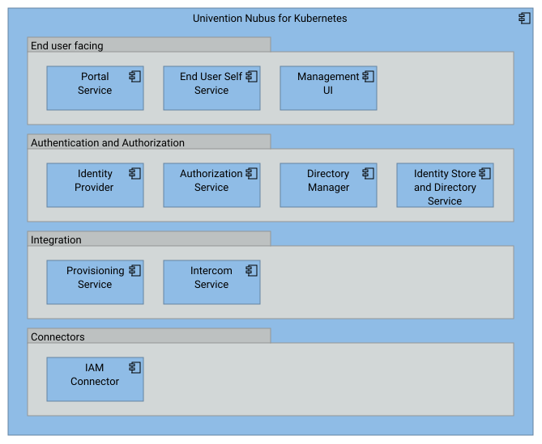

<!--
SPDX-FileCopyrightText: 2024 Zentrum für Digitale Souveränität der Öffentlichen Verwaltung (ZenDiS) GmbH
SPDX-License-Identifier: Apache-2.0
-->

<h1>openDesk APIs</h1>

This chapter presents APIs available in openDesk, grouped by application.

<!-- TOC -->
* [IAM - Nubus](#iam---nubus)
  * [UMC Python API](#umc-python-api)
  * [UMC store API](#umc-store-api)
  * [IntercomService (ICS) API](#intercomservice-ics-api)
  * [High-level Listener modules API](#high-level-listener-modules-api)
  * [UDM Simple API](#udm-simple-api)
  * [UDM REST API](#udm-rest-api)
  * [UCR Python API](#ucr-python-api)
  * [Identity Store and Directory Service (LDAP)](#identity-store-and-directory-service-ldap)
  * [Nubus Provisioning Service](#nubus-provisioning-service)
  * [Nubus Authorization Service](#nubus-authorization-service)
* [Groupware - OX AppSuite / OX Dovecot](#groupware---ox-appsuite--ox-dovecot)
  * [Usage of APIs within openDesk](#usage-of-apis-within-opendesk)
  * [HTTP API](#http-api)
  * [SOAP API](#soap-api)
  * [REST API](#rest-api)
  * [CardDAV](#carddav)
  * [CalDAV](#caldav)
  * [IMAP](#imap)
  * [POP3](#pop3)
* [Files - Nextcloud](#files---nextcloud)
  * [Usage of APIs within openDesk](#usage-of-apis-within-opendesk-1)
  * [OCS API](#ocs-api)
  * [Notifications API](#notifications-api)
  * [Activity API](#activity-api)
  * [Remote wipe API](#remote-wipe-api)
  * [WebDAV](#webdav)
  * [CalDAV / CardDAV](#caldav--carddav)
* [Weboffice - Collabora](#weboffice---collabora)
  * [PostMessage API](#postmessage-api)
  * [Conversion API](#conversion-api)
* [Project management - OpenProject](#project-management---openproject)
  * [HATEOAS API](#hateoas-api)
  * [BCF API](#bcf-api)
* [Video Conferencing - Jitsi](#video-conferencing---jitsi)
  * [IFrame API](#iframe-api)
  * [lib-jitsi-meet API](#lib-jitsi-meet-api)
  * [Jitsi Meet React SDK](#jitsi-meet-react-sdk)
* [Chat - Element](#chat---element)
  * [Matrix Application Service API](#matrix-application-service-api)
  * [Matrix Client-Server API](#matrix-client-server-api)
  * [Matrix Server-Server API](#matrix-server-server-api)
  * [Matrix Push Gateway API](#matrix-push-gateway-api)
  * [Matrix Identity Service API](#matrix-identity-service-api)
  * [Matrix React SDK Module API](#matrix-react-sdk-module-api)
  * [Matrix Widget API](#matrix-widget-api)
  * [NeoBoard Data Model API](#neoboard-data-model-api)
  * [NeoDateFix REST API](#neodatefix-rest-api)
* [Knowledge management - XWiki](#knowledge-management---xwiki)
  * [REST API](#rest-api-1)
  * [Scripting API](#scripting-api)
  * [Java API](#java-api)
  * [JavaScript API](#javascript-api)
<!-- TOC -->

# IAM - Nubus

  
[Source](https://docs.software-univention.de/nubus-kubernetes-architecture/latest/en/overview/components.html#overview-components-fig)

## UMC Python API

  
[Source](https://docs.software-univention.de/developer-reference/latest/en/umc/architecture.html#umc-api)

| Name                           | UMC Python API                                                                                                                                                                                                                                 |
| ------------------------------ | ---------------------------------------------------------------------------------------------------------------------------------------------------------------------------------------------------------------------------------------------- |
| Purpose                        |                                                                                                                                                                                                                                                |
| Versioning                     |                                                                                                                                                                                                                                                |
| Authentication                 |                                                                                                                                                                                                                                                |
| In openDesk provided by        | Nubus UMC                                                                                                                                                                                                                                      |
| Transport protocol             |                                                                                                                                                                                                                                                |
| Usage within component         |                                                                                                                                                                                                                                                |
| Usage within openDesk          |                                                                                                                                                                                                                                                |
| Usage for external integration |                                                                                                                                                                                                                                                |
| Parallel access                | Allowed                                                                                                                                                                                                                                        |
| Message protocol               | [Univention Management Console Protocol (UMCP)](https://docs.software-univention.de/ucs-python-api/univention.management.console.protocol.html). Format consisting of a single header line, one empty line and the body. The body can be JSON. |
| Supported standards            |                                                                                                                                                                                                                                                |
| Documentation                  | https://docs.software-univention.de/ucs-python-api/modules.html                                                                                                                                                                                |

## UMC store API

| Name                           | UMC store API (also named UMC JavaScript API or Dojo/UMC JavaScript API)                                     |
| ------------------------------ | ----------------------------------------------------------------------------------------------------------   |
| Purpose                        | Encapsulate and ease the access to JavaScript module data                                                    |
| Versioning                     |                                                                                                              |
| Authentication                 |                                                                                                              |
| In openDesk provided by        | Nubus UMC                                                                                                    |
| Transport protocol             |                                                                                                              |
| Usage within component         |                                                                                                              |
| Usage within openDesk          |                                                                                                              |
| Usage for external integration |                                                                                                              |
| Parallel access                | Allowed                                                                                                      |
| Message protocol               |                                                                                                              |
| Supported standards            |                                                                                                              |
| Documentation                  | https://docs.software-univention.de/developer-reference/latest/en/umc/local-system-module.html#umc-store-api |

## IntercomService (ICS) API

| Name                           | IntercomService API                                                                                                                                                                                                                 |
| ------------------------------ | ----------------------------------------------------------------------------------------------------------------------------------------------------------------------------------------------------------------------------------- |
| Purpose                        | Encapsulate and ease the access to module data from JavaScript                                                                                                                                                                      |
| Versioning                     |                                                                                                                                                                                                                                     |
| Authentication                 | IdP based SSO                                                                                                                                                                                                                       |
| In openDesk provided by        | Nubus UMC                                                                                                                                                                                                                           |
| Transport protocol             | HTTP(S)                                                                                                                                                                                                                             |
| Usage within component         |                                                                                                                                                                                                                                     |
| Usage within openDesk          | The ICS implements the BFF pattern for various openDesk inter-component integrations, see [components.md](https://gitlab.opencode.de/bmi/opendesk/deployment/opendesk/-/blob/develop/docs/components.md#component-integration)      |
| Usage for external integration |                                                                                                                                                                                                                                     |
| Parallel access                | Allowed                                                                                                                                                                                                                             |
| Message protocol               | Depends on the integration use case.                                                                                                                                                                                                |
| Supported standards            |                                                                                                                                                                                                                                     |
| Documentation                  | https://docs.software-univention.de/intercom-service/latest/architecture.html                                                                                                                                                       |

## High-level Listener modules API

| Name                           | High-level Listener modules API                                                                                                                                                                                                     |
| ------------------------------ | ----------------------------------------------------------------------------------------------------------------------------------------------------------------------------------------------------------------------------------- |
| Purpose                        | Dispatching of LDAP events.                                                                                                                                                                                                         |
| Versioning                     |                                                                                                                                                                                                                                     |
| Authentication                 |                                                                                                                                                                                                                                     |
| In openDesk provided by        | Univention Event Processing                                                                                                                                                                                                         |
| Transport protocol             |                                                                                                                                                                                                                                     |
| Usage within component         | The listener mechanism is used to dispatch events from the LDAP to the Nubus provisioning service. It should be replaced with another approach in the future.                                                                       |
| Usage within openDesk          | The ICS implements the BFF pattern for various openDesk inter-component integrations, see also [components.md](https://gitlab.opencode.de/bmi/opendesk/deployment/opendesk/-/blob/develop/docs/components.md#component-integration) |
| Usage for external integration |                                                                                                                                                                                                                                     |
| Parallel access                | Allowed                                                                                                                                                                                                                             |
| Message protocol               | Depends on the integration use case.                                                                                                                                                                                                |
| Supported standards            |                                                                                                                                                                                                                                     |
| Documentation                  | https://docs.software-univention.de/developer-reference/latest/en/listener/api.html                                                                                                                                                 |

More details on the Nubus provisioning service can be found here: https://docs.software-univention.de/nubus-kubernetes-architecture/latest/en/components/provisioning-service.html

## UDM Simple API

  
[Source](https://docs.software-univention.de/architecture/latest/en/services/udm.html#architecture-model-udm)

| Name                           | UDM Simple API                                                                                                                                    |
| ------------------------------ | -------------------------------------------------------------------                                                                               |
| Purpose                        | Allows use of capability and objects directly in Python programs.                                                                                 |
| Versioning                     |                                                                                                                                                   |
| Authentication                 |                                                                                                                                                   |
| In openDesk provided by        | Univention Directory Manager                                                                                                                      |
| Transport protocol             |                                                                                                                                                   |
| Usage within component         | Allows to use UDM capability and objects directly in Python programs. UDM Simple API provides Python modules and classes below `univention.udm.*` |
| Usage within openDesk          |                                                                                                                                                   |
| Usage for external integration |                                                                                                                                                   |
| Parallel access                | Allowed                                                                                                                                           |
| Message protocol               | Depends on the integration use case.                                                                                                              |
| Supported standards            |                                                                                                                                                   |
| Documentation                  | https://docs.software-univention.de/ucs-python-api/univention.udm.html#module-univention.udm.                                                     |

## UDM REST API

| Name                           | UDM REST API                                                                                                                               |
| ------------------------------ | ------------------------------------------------------------------------------------------------------------------------------------------ |
| Purpose                        | Inspect, modify, create and delete objects through HTTP requests.                                                                          |
| Versioning                     |                                                                                                                                            |
| Authentication                 | Basic Auth                                                                                                                                 |
| In openDesk provided by        | Univention Directory Manager                                                                                                               |
| Transport protocol             | HTTP()                                                                                                                                     |
| Usage within component         | The Nubus bootstrapping process makes use of the API.                                                                                      |
| Usage within openDesk          |                                                                                                                                            |
| Usage for external integration | The [openDesk User Importer](https://gitlab.opencode.de/bmi/opendesk/components/platform-development/images/user-import) utilizes the API. |
| Parallel access                | Allowed                                                                                                                                    |
| Message protocol               | Depends on the integration use case.                                                                                                       |
| Supported standards            |                                                                                                                                            |
| Documentation                  | https://docs.software-univention.de/nubus-kubernetes-customization/latest/en/api/udm-rest.html                                             |

## UCR Python API

  
[Source](https://docs.software-univention.de/architecture/latest/en/services/ucr.html#services-ucr-architecture-model)

| Name                           | UCR Python API                                                                                         |
| ------------------------------ | ---------------------------------------------------------------------------------------------------    |
| Purpose                        | Offers a programming interface for components and other Python programs.                               |
| Versioning                     |                                                                                                        |
| Authentication                 |                                                                                                        |
| In openDesk provided by        | Nubus                                                                                                  |
| Transport protocol             |                                                                                                        |
| Usage within component         | The Nubus bootstrapping process makes use of the API.                                                  |
| Usage within openDesk          |                                                                                                        |
| Usage for external integration |                                                                                                        |
| Parallel access                | Allowed                                                                                                |
| Message protocol               |                                                                                                        |
| Supported standards            |                                                                                                        |
| Documentation                  | https://docs.software-univention.de/developer-reference/latest/en/ucr/usage.html#using-ucr-from-python |

## Identity Store and Directory Service (LDAP)

  
[Source](https://docs.software-univention.de/nubus-kubernetes-architecture/latest/en/components/identity-store.html#component-identity-store-figure)

| Name                           | Identity Store and Directory Service (LDAP)                                                                                                           |
| ------------------------------ | -------------------------------------------------------------------------------------------------------------------------                             |
| Purpose                        | Read access to Nubus LDAP                                                                                                                             |
| Versioning                     | n/a                                                                                                                                                   |
| Authentication                 | LDAP user auth                                                                                                                                        |
| In openDesk provided by        | Nubus openLDAP                                                                                                                                        |
| Transport protocol             | LDAP                                                                                                                                                  |
| Usage within component         | Data backend for Nubus                                                                                                                                |
| Usage within openDesk          | Used by multiple applications to access user/group data, e.g. Nextcloud Server, OpenProject, OX AppSuite backend, XWiki                               |
| Usage for external integration | Not recommended                                                                                                                                       |
| Parallel access                | Allowed                                                                                                                                               |
| Message protocol               | LDAP                                                                                                                                                  |
| Supported standards            | LDAP                                                                                                                                                  |
| Documentation                  | https://docs.software-univention.de/nubus-kubernetes-architecture/latest/en/components/identity-store.html#component-identity-store-directory-service |

## Nubus Provisioning Service

  
[Source](https://docs.software-univention.de/nubus-kubernetes-architecture/latest/en/components/provisioning-service.html#component-provisioning-service-complete-figure)

| Name          | Nubus Proisioning Service                                                                                        |
| ------------- | ---------------------------------------------------------------------------------------------------              |
| Documentation | https://docs.software-univention.de/nubus-kubernetes-architecture/latest/en/components/provisioning-service.html |

## Nubus Authorization Service

  
[Source](https://docs.software-univention.de/nubus-kubernetes-architecture/latest/en/overview/interfaces-protocols.html#authorization-service)

| Name          | Nubus Authorization Service                                                                                                          |
| ------------- | ---------------------------------------------------------------------------------------------------                                  |
| Documentation | https://docs.software-univention.de/nubus-kubernetes-architecture/latest/en/overview/interfaces-protocols.html#authorization-service |

# Groupware - OX AppSuite / OX Dovecot

## Usage of APIs within openDesk

The following are the APIs used by the Groupware application:

| Used by                        | Accessed component | Service            | Purpose                                                     | Message format                   |
| ------------------------------ | ------------------ | ------------------ | ----------------------------------------------------------- | -------------------------------- |
| AppSuite Middleware            | Keycloak           | Authentication     | Single sign-on / sign-out                                   | OIDC                             |
| Dovecot                        | Keycloak           | Authentication     | Authenticate user                                           | OIDC                             |
| AppSuite Frontend (in Browser) | Intercom Service   | Silent Login       | Establish Intercom Service session                          |                                  |
| AppSuite Frontend (in Browser) | Intercom Service   | Central Navigation | Retrieve content for openDesk Navigation drop-down          | JSON                             |
| AppSuite Frontend (in Browser) | Intercom Service   | Element Bot        | Manage (CUD) meetings in Element                            | Custom JSON (based on iCalender) |
| AppSuite Frontend (in Browser) | Intercom Service   | Filepicker         | Read/write contents from/to Nextcloud or create share links | WebDAV & Nextcloud API           |
| AppSuite Middleware            | Nextcloud          | Filepicker         | Read/write files from/to Nextcloud                          | WebDAV & Nextcloud API           |
| AppSuite Middleware            | Element Bot        | Element Bot        | Update/delete meetings in Element                           | Custom JSON (based on iCalender) |
| AppSuite Middleware            | LDAP               | Address book       | Search for global contacts and retrieve contact details     | LDAP                             |
| Dovecot                        | LDAP               | Data retrieval     | Retrieve necessary user details to handle mailboxes         | LDAP                             |

## HTTP API

| Name                           | HTTP API                                                                                                                                                                                                     |
| ------------------------------ | --------------------------------------------------------------------------------------------------------------------------------------------------------------------------------------------------------------- |
| Purpose                        | Login, accessing email, contacts, calendar, tasks, configs, email filtering, task automation, workflow automation, etc – most of the AppSuite's functionality that is available to the user through the Web-UI. |
| Versioning                     | No API-specific versioning. The version can be considered identical to the OX App Suite version, which is contained in the URL of the online API documentation.                                                 |
| Authentication                 |                                                                                                                                                                                                                 |
| In openDesk provided by        | OX AppSuite Middleware                                                                                                                                                                                          |
| Transport protocol             | HTTP(S)                                                                                                                                                                                                         |
| Usage within component         | Used by OX Web-UI (Frontend)                                                                                                                                                                                    |
| Usage within openDesk          | - Nextcloud uses the SearchAPI to synchronize contacts - Nordeck Meeting bot synchronizes OX meeting changes applied in Element.                                                                             |
| Usage for external integration | Not used at the moment, but is the recommended way to integrate with OX AppSuite.                                                                                                                               |
| Parallel access                | Allowed                                                                                                                                                                                                         |
| Message protocol               | JSON based, AppSuite specific format                                                                                                                                                                            |
| Supported standards            | iCal, defined by RFC, fully implemented                                                                                                                                                                         |
| Documentation                  | https://documentation.open-xchange.com/components/middleware/http/8/index.html                                                                                                                                  |

## SOAP API

| Name                           | SOAP API                                                                                  |
| ------------------------------ | -------------------------------------------------------------------------------------------- |
| Purpose                        | Management of users, groups, contexts, resources.                                            |
| Versioning                     | n/a                                                                                          |
| Authentication                 | Basic Auth                                                                                   |
| In openDesk provided by        | OX AppSuite Middleware                                                                       |
| Transport protocol             | HTTP(S)                                                                                      |
| Usage within component         | none                                                                                         |
| Usage within openDesk          | OX-Connector synchronizes the state of the objects (users, groups etc.) managed in the LDAP. |
| Usage for external integration | none                                                                                         |
| Parallel access                | Allowed                                                                                      |
| Message protocol               | XML based, exactly following the format of Java RMI.                                         |
| Supported standards            | SOAP                                                                                         |
| Documentation                  | https://software.open-xchange.com/products/appsuite/doc/SOAP/admin/OX-Admin-SOAP.html        |

> **Note**:
> You will find a catalogue of the available services including links to the respective URLs at `/webservices/` within the AppSuite host of your openDesk installation, e.g. https://webmail.myopendesk.tld/webservices/

## REST API

| Name                           | REST API                                                                                                                                                                                                                                                                                                                                                                                                                                                                                            |
| ------------------------------ |-----------------------------------------------------------------------------------------------------------------------------------------------------------------------------------------------------------------------------------------------------------------------------------------------------------------------------------------------------------------------------------------------------------------------------------------------------------------------------------------------------|
| Purpose                        | Delivers services in the following functional groups: - *Admin*: Interface for provisioning and other administrative operations - *Advertisement*: The advertisement module - *Health*: The health-check module - *InternetFreeBusy*: Servlet for requesting free busy data - *Metrics*: The metrics module - *Preliminary*: This module contains preliminary endpoints which may change in the future - *Push*: The push module - *Userfeedback*: The user feedback module |
| Versioning                     | No API-specific versioning. The version can be considered identical to the OX App Suite version, which is contained in the URL of the online API documentation.                                                                                                                                                                                                                                                                                                                                     |
| Authentication                 | Basic Auth                                                                                                                                                                                                                                                                                                                                                                                                                                                                                          |
| In openDesk provided by        | OX AppSuite Middleware                                                                                                                                                                                                                                                                                                                                                                                                                                                                              |
| Transport protocol             | HTTP(S)                                                                                                                                                                                                                                                                                                                                                                                                                                                                                             |
| Usage within component         | Push module is used by OX Frontend.                                                                                                                                                                                                                                                                                                                                                                                                                                                                 |
| Usage within openDesk          | none                                                                                                                                                                                                                                                                                                                                                                                                                                                                                                |
| Usage for external integration | none                                                                                                                                                                                                                                                                                                                                                                                                                                                                                                |
| Parallel access                | Allowed                                                                                                                                                                                                                                                                                                                                                                                                                                                                                             |
| Message protocol               | - Email Body RFC 822 is used by Push - Prometheus format is used by Metrics API - API iCal format is used by InternetFreeBusy                                                                                                                                                                                                                                                                                                                                                                 |
| Supported standards            | SOAP                                                                                                                                                                                                                                                                                                                                                                                                                                                                                                |
| Documentation                  | https://documentation.open-xchange.com/components/middleware/rest/8/index.html                                                                                                                                                                                                                                                                                                                                                                                                                      |
## CardDAV

| Name                           | CardDAV                                                                                                                                                                 |
| ------------------------------ | -------------------------------------------------------------------------------------------------------------------------------------------------------------------------- |
| Purpose                        | Designed for rich clients. Synchronization of contact entries in both directions (i.e. as a server and as a client); vCard import and export are available via OX HTTP API |
| Versioning                     | Yes, API version is specific to the version of the underlying protocol                                                                                                     |
| Authentication                 |                                                                                                                                                                            |
| In openDesk provided by        | OX AppSuite Middleware                                                                                                                                                     |
| Transport protocol             | HTTP(S)                                                                                                                                                                    |
| Usage within component         | none                                                                                                                                                                       |
| Usage within openDesk          | none                                                                                                                                                                       |
| Usage for external integration | none                                                                                                                                                                       |
| Parallel access                | Allowed                                                                                                                                                                    |
| Message protocol               | vCard, defined by RFC, fully implemented                                                                                                                                   |
| Supported standards            |                                                                                                                                                                            |
| Documentation                  | https://documentation.open-xchange.com/8/middleware/miscellaneous/caldav_carddav.html                                                                                      |

## CalDAV

| Name                           | CalDAV                                                                                                                                                                  |
| ------------------------------ | -------------------------------------------------------------------------------------------------------------------------------------------------------------------------- |
| Purpose                        | Designed for rich clients. Synchronization of contact entries in both directions (i.e. as a server and as a client); vCard import and export are available via OX HTTP API |
| Versioning                     | Yes, API version is specific to the version of the underlying protocol                                                                                                     |
| Authentication                 |                                                                                                                                                                            |
| In openDesk provided by        | OX AppSuite Middleware                                                                                                                                                     |
| Transport protocol             | HTTP(S)                                                                                                                                                                    |
| Usage within component         | none                                                                                                                                                                       |
| Usage within openDesk          | none                                                                                                                                                                       |
| Usage for external integration | none                                                                                                                                                                       |
| Parallel access                | Allowed                                                                                                                                                                    |
| Message protocol               | iCal, defined by RFC, fully implemented                                                                                                                                    |
| Supported standards            | iTIP, iMIP                                                                                                                                                                 |
| Documentation                  | https://documentation.open-xchange.com/8/middleware/miscellaneous/caldav_carddav.html                                                                                      |

## IMAP

| Name                           | IMAP                                                                                 |
| ------------------------------ |--------------------------------------------------------------------------------------|
| Purpose                        | Used for retrieval of emails, designed for rich clients                              |
| Versioning                     | Yes, API version is specific to the version of the underlying protocol               |
| Authentication                 |                                                                                      |
| In openDesk provided by        | OX Dovecot                                                                           |
| Transport protocol             | TCP                                                                                  |
| Usage within component         | Used by OX AppSuite middleware to read/write mail and folders                        |
| Usage within openDesk          | none                                                                                 |
| Usage for external integration | Can be used by local IMAP clients (e.g. Thunderbird)                                 |
| Parallel access                | Allowed                                                                              |
| Message protocol               | RFC 9051                                                                             |
| Supported standards            | IMAP                                                                                 |
| Documentation                  | https://www.rfc-editor.org/rfc/rfc9051                                               |

## POP3

| Name                           | POP3                                                                   |
| ------------------------------ |------------------------------------------------------------------------|
| Purpose                        | Used for retrieval of emails, designed for rich clients                |
| Versioning                     | Yes, API version is specific to the version of the underlying protocol |
| Authentication                 |                                                                        |
| In openDesk provided by        | OX Dovecot                                                             |
| Transport protocol             | TCP                                                                    |
| Usage within component         | none                                                                   |
| Usage within openDesk          | none                                                                   |
| Usage for external integration | Can be used by local POP3 clients (e.g. Thunderbird)                   |
| Parallel access                | Allowed                                                                |
| Message protocol               | RFC 1939                                                               |
| Supported standards            | IMAP                                                                   |
| Documentation                  | https://www.rfc-editor.org/rfc/rfc1939                                 |

# Files - Nextcloud

## Usage of APIs within openDesk

The following are the APIs used by the Files application:

| Used by          | Accessed component     | Service                | Purpose                                            | Message format |
| ---------------- | ---------------------- | ---------------------- | -------------------------------------------------- | -------------- |
| Nextcloud Server | Keycloak               | Authentication         | Single sign-on / sign-out                          | OIDC           |
| Nextcloud Server | Nubus Portal           | Central Navigation     | Retrieve content for openDesk Navigation drop-down | JSON           |
| Nextcloud Server | OX AppSuite Middleware | OX HTTP API (Contacts) | Reading/writing personal contacts                  | JSON           |
| Nextcloud Server | Nubus                  | LDAP                   | Read users and groups data                         | LDAP           |

## OCS API

| Name                           | OCS API                                                                                                                                                                                                                                |
| ------------------------------ | -------------------------------------------------------------------------------------------------------------------------------------------------------------------------------------------------------------------------------------- |
| Purpose                        | Obtain and/or manage user status, user preferences, shares, sharees, recommendations. API is likely to be extended to other use cases in the future. Nextcloud apps can extend the functionality of OCS API by providing new endpoints |
| Versioning                     | Identical to component release version                                                                                                                                                                                                  |
| Authentication                 | Basic Auth or by passing a set of valid session cookies                                                                                                                                                                                |
| In openDesk provided by        | Nextcloud Server                                                                                                                                                                                                                       |
| Transport protocol             | HTTP(S)                                                                                                                                                                                                                                |
| Usage within component         | none                                                                                                                                                                                                                                   |
| Usage within openDesk          | Filepicker uses the API to create share links.                                                                                                                                                                                         |
| Usage for external integration | none                                                                                                                                                                                                                                   |
| Parallel access                | Allowed                                                                                                                                                                                                                                |
| Message protocol               | Requests in JSON, responses in JSON or XML                                                                                                                                                                                             |
| Supported standards            |                                                                                                                                                                                                                                        |
| Documentation                  | https://docs.nextcloud.com/server/latest/developer_manual/client_apis/OCS/index.html                                                                                                                                                   |

## Notifications API

| Name                           | Notifications API                                                                                                           |
| ------------------------------ | --------------------------------------------------------------------------------------------------------------------------- |
| Purpose                        | Fetch notifications                                                                                                         |
| Versioning                     | See linked documentation (which also names the version), address via URL path, e.g. `/ocs/v2.php/apps/notifications/api/v2` |
| Authentication                 |                                                                                                                             |
| In openDesk provided by        | Nextcloud Server                                                                                                            |
| Transport protocol             | HTTP(S)                                                                                                                     |
| Usage within component         | none                                                                                                                        |
| Usage within openDesk          | none                                                                                                                        |
| Usage for external integration | none                                                                                                                        |
| Parallel access                | Allowed                                                                                                                     |
| Message protocol               | Requests in JSON, responses in JSON or XML                                                                                  |
| Supported standards            |                                                                                                                             |
| Documentation                  | https://github.com/nextcloud/notifications/blob/master/docs/ocs-endpoint-v2.md                                              |
|                                |                                                                                                                             |

## Activity API

| Name                           | Activity API                                                                                                                                       |
| ------------------------------ |----------------------------------------------------------------------------------------------------------------------------------------------------|
| Purpose                        | Obtaining the list of actions initiated by or involving a specific user (files created, shared, deleted etc and other activities reported by apps) |
| Versioning                     | Identical to component release version                                                                                                           |
| Authentication                 | See linked documentation (which also names the version), address via URL path, e.g. `/ocs/v2.php/apps/activity/api/v2`                             |
| In openDesk provided by        | Nextcloud Server                                                                                                                                   |
| Transport protocol             | HTTP(S)                                                                                                                                            |
| Usage within component         | none                                                                                                                                               |
| Usage within openDesk          | none                                                                                                                                               |
| Usage for external integration | none                                                                                                                                               |
| Parallel access                | Allowed                                                                                                                                            |
| Message protocol               | Requests in JSON, responses in JSON or XML                                                                                                         |
| Supported standards            |                                                                                                                                                    |
| Documentation                  | https://github.com/nextcloud/activity/blob/master/docs/endpoint-v2.md                                                                              |

## Remote wipe API

| Name                           | Remote wipe API                                                                            |
| ------------------------------ |--------------------------------------------------------------------------------------------|
| Purpose                        | Used to wipe storage remotely (e.g. on a lost device)                                      |
| Versioning                     | Identical to component release version                                                     |
| Authentication                 | Login flow token                                                                           |
| In openDesk provided by        | Nextcloud Server                                                                           |
| Transport protocol             | HTTP(S)                                                                                    |
| Usage within component         | none                                                                                       |
| Usage within openDesk          | none                                                                                       |
| Usage for external integration | none                                                                                       |
| Parallel access                | Allowed                                                                                    |
| Message protocol               | JSON                                                                                       |
| Supported standards            |                                                                                            |
| Documentation                  | https://docs.nextcloud.com/server/latest/developer_manual/client_apis/RemoteWipe/index.html |

## WebDAV

| Name                           | WebDAV                                                                                  |
| ------------------------------ |-----------------------------------------------------------------------------------------|
| Purpose                        | Accessing files and folders, conducting searches                                        |
| Versioning                     | Identical to component release version                                                  |
| Authentication                 | Basic Auth or by passing a set of valid session cookies                                 |
| In openDesk provided by        | Nextcloud Server                                                                        |
| Transport protocol             | HTTP(S)                                                                                 |
| Usage within component         | none                                                                                    |
| Usage within openDesk          | Used by OX AppSuite to get/put files (attachments)                                      |
| Usage for external integration | none                                                                                    |
| Parallel access                | Allowed                                                                                 |
| Message protocol               | Requests in JSON, responses in JSON or XML                                              |
| Supported standards            | RFC4918                                                                                 |
| Documentation                  | https://docs.nextcloud.com/server/latest/developer_manual/client_apis/WebDAV/index.html |

## CalDAV / CardDAV

CalDAV and CardDAV APIs are available in Nextcloud, but as openDesk uses OX AppSuite for Calendar and Contacts these Nextcloud APIs do not provide relevant data in openDesk.

# Weboffice - Collabora

The following are the APIs used by the Weboffice application:

| Used by   | Accessed component | Service           | Purpose                                     | Message format |
| --------- | ------------------ | ----------------- | ------------------------------------------- | -------------- |
| Collabora | Nextcloud          | Document handling | Retrieve, store and manage office documents | WOPI           |

Collabora is integrated with Nextcloud to read/write Office documents from/to Nextcloud. The integration uses the Web
Application Open Interface ([WOPI](https://learn.microsoft.com/en-us/openspecs/office_protocols/ms-wopi/6a8bb410-68ad-47e4-9dc3-6cf29c6b046b)) protocol.

Nextcloud acts as the WOPI server whereas Collabora Online is the WOPI client.

## PostMessage API

| Name                           | PostMessage API                                                                                                                                   |
| ------------------------------ |---------------------------------------------------------------------------------------------------------------------------------------------------|
| Purpose                        | Interact with parent frame when Collabora browser part is enclosed in one, mostly based on WOPI specification with few extensions/modifications   |
| Versioning                     | N/A                                                                                                                                               |
| Authentication                 | CSP rules protect unauthorized communication. In practice, the editor is embedded in an iframe and can communicate only with the iframe's parent. |
| In openDesk provided by        | Collabora                                                                                                                                         |
| Transport protocol             | HTTP                                                                                                                                              |
| Usage within component         | N/A                                                                                                                                               |
| Usage within openDesk          | Query the number of users in a document, query supported export formats, manage sessions, manage actions like save, insert image, print etc.      |
| Usage for external integration | In openDesk Collabora Online is integrated with Nextcloud but other integrations exist and are possible, see the documentation.                   |
| Parallel access                | Allowed                                                                                                                                           |
| Message protocol               | JSON                                                                                                                                              |
| Supported standards            | [WOPI](https://learn.microsoft.com/en-us/openspecs/office_protocols/ms-wopi/6a8bb410-68ad-47e4-9dc3-6cf29c6b046b)                                 |
| Documentation                  | https://sdk.collaboraonline.com/docs/postmessage_api.html                                                                                         |

## Conversion API

| Name                           | Conversion API                                                                                          |
| ------------------------------ | ------------------------------------------------------------------------------------------------------- |
| Purpose                        | Convert files between various file formats (e.g. to pdf, png, txt, or between OOXML and ODF etc.)       |
| Versioning                     | N/A                                                                                                     |
| Authentication                 | The `convert-to` endpoint is restricted to allowed host addresses that can be set in the configuration. |
| In openDesk provided by        | Collabora                                                                                               |
| Transport protocol             | HTTP (REST API)                                                                                         |
| Usage within component         | N/A                                                                                                     |
| Usage within openDesk          | To generate thumbnails in Nextcloud for supported document types.                                       |
| Usage for external integration | It is possible to set up Collabora Online as a general document converter service.                      |
| Parallel access                | Allowed                                                                                                 |
| Message protocol               | Text based, see the documentation                                                                       |
| Supported standards            | N/A                                                                                                     |
| Documentation                  | https://sdk.collaboraonline.com/docs/conversion_api.html                                                |

# Project management - OpenProject

The following are the APIs used by the Project management application:

| Used by         | Accessed component | Service            | Purpose                                            | Message format |
| --------------- | ------------------ | ------------------ | -------------------------------------------------- | -------------- |
| OpenProject-web | Keycloak           | Authentication     | Single sign-on / sign-out                          | OIDC           |
| OpenProject-web | Nubus Portal       | Central Navigation | Retrieve content for openDesk Navigation drop-down | JSON           |
| OpenProject-web | Nextcloud          | Various            | Integration of Nextcloud as OpenProject filestore  | JSON           |
| OpenProject-web | Nubus              | LDAP               | Read users and groups data                         | LDAP           |

## HATEOAS API

| Name                           | HATEOAS (Hyperimages as the Engine of Application State) API                                                                                                                                                                                                                                                                                      |
| ------------------------------ | ------------------------------------------------------------------------------------------------------------------------------------------------------------------------------------------------------------------------------------------------------------------------------------------------------------------------------------------------- |
| Purpose                        | Provides access for the frontend client of OpenProject and for third party use, i.e.: - CRUD work packages, projects, time logging, users, queries (work package filters), and all related objects - READ notifications, activities per work package - READ capabilities (allowed actions of users throughout projects) does not address |
| Versioning                     | URL based versioning scheme, e.g. `/api/v3/spec.json`                                                                                                                                                                                                                                                                                             |
| Authentication                 | OAuth2, session based authentication, and basic auth                                                                                                                                                                                                                                                                                              |
| In openDesk provided by        | OpenProject                                                                                                                                                                                                                                                                                                                                       |
| Transport protocol             | HTTP(S)                                                                                                                                                                                                                                                                                                                                           |
| Usage within component         | OpenProject Web-UI                                                                                                                                                                                                                                                                                                                                |
| Usage within openDesk          | none                                                                                                                                                                                                                                                                                                                                              |
| Usage for external integration | none                                                                                                                                                                                                                                                                                                                                              |
| Parallel access                | Allowed                                                                                                                                                                                                                                                                                                                                           |
| Message protocol               | [HAL](https://en.wikipedia.org/wiki/Hypertext_Application_Language) + JSON                                                                                                                                                                                                                                                                        |
| Supported standards            | REST, [HATEOAS](https://en.wikipedia.org/wiki/HATEOAS)                                                                                                                                                                                                                                                                                            |
| Documentation                  | https://www.openproject.org/docs/api/introduction/                                                                                                                                                                                                                                                                                                |

**Additional Information:**

*What does it not do that developers should know about?*
- CRUD custom fields, time reports, wikis and wiki pages
- Aggregated filterable activities/changes

*What are the typical use cases?*
- It powers all angular frontend components in OpenProject, mainly the work package table/view, boards, team planner etc., and supports all common use cases

*How does it work? (What do users need to know about architecture an internal components?)*
- HAL is a standard to define resources with embedding and links between them
- HAL contains action links depending on the user’s permissions, allows permitted actions to be derived from object keys in json

*What knowledge should the developer have before using the API?*
- Knowledge of REST
- (Optional) Knowledge of HAL standard

*Are there any extensions or APIs in (or planned for) development that users should know about?*
- Signaling to receive only selected attributes/nested resources from the API for performance improvements

## BCF API

| Name                           | BCF API                                                                                                                                                                              |
| ------------------------------ |--------------------------------------------------------------------------------------------------------------------------------------------------------------------------------------|
| Purpose                        | Implementation of a subset of [BCF](https://en.wikipedia.org/wiki/BIM_Collaboration_Format) standard for [BIM](https://en.wikipedia.org/wiki/Building_information_modeling) projects |
| Versioning                     | URL based versioning scheme, e.g. `/api/bcf/2.1`                                                                                                                                     |
| Authentication                 | OAuth2                                                                                                                                                                               |
| In openDesk provided by        | OpenProject                                                                                                                                                                          |
| Transport protocol             | HTTP(S)                                                                                                                                                                              |
| Usage within component         | none                                                                                                                                                                                 |
| Usage within openDesk          | none                                                                                                                                                                                 |
| Usage for external integration | none                                                                                                                                                                                 |
| Parallel access                | Allowed                                                                                                                                                                              |
| Message protocol               | JSON                                                                                                                                                                                 |
| Supported standards            | [BCF 2.1](https://github.com/buildingSMART/BCF-API/blob/release_2_1/README.md)                                                                                                       |
| Documentation                  | https://www.openproject.org/docs/api/bcf-rest-api/                                                                                                                                   |

# Video Conferencing - Jitsi

## IFrame API

| Name                           | IFrame API                                                               |
| ------------------------------ |--------------------------------------------------------------------------|
| Purpose                        | Embed Jitsi video conferencing features into existing applications/sites |
| Versioning                     | Identical to the Jitsi release version                                   |
| Authentication                 | Optional (JWT-based authentication in openDesk context)                  |
| In openDesk provided by        | Jitsi-Web                                                                |
| Transport protocol             | HTTP(S)                                                                  |
| Usage within component         | none                                                                     |
| Usage within openDesk          | Used by Element (Chat Web-UI)                                            |
| Usage for external integration | none                                                                     |
| Parallel access                | Allowed                                                                  |
| Message protocol               |                                                                          |
| Supported standards            |                                                                          |
| Documentation                  | https://jitsi.github.io/handbook/docs/dev-guide/dev-guide-iframe/        |

## lib-jitsi-meet API

| Name                           | lib-jitsi-meet API                                                     |
| ------------------------------ | ---------------------------------------------------------------------- |
| Purpose                        | Create Jitsi video conferences with a custom GUI                       |
| Versioning                     | Identical to the Jitsi release                                         |
| Authentication                 | not required                                                           |
| In openDesk provided by        | Jitsi-Web                                                              |
| Transport protocol             | none (it works as a library)                                           |
| Usage within component         | Used by Jitsi itself                                                   |
| Usage within openDesk          | Used by Jitsi itself                                                   |
| Usage for external integration | none                                                                   |
| Parallel access                | Allowed                                                                |
| Message protocol               |                                                                        |
| Supported standards            |                                                                        |
| Documentation                  | https://jitsi.github.io/handbook/docs/dev-guide/dev-guide-ljm-api/     |

## Jitsi Meet React SDK

> **Note** 
> Additional SDKs can be found at https://jitsi.github.io/handbook/docs/category/sdks/

| Name                           | Meet React SDK                                                      |
| ------------------------------ | ------------------------------------------------------------------- |
| Purpose                        | Embed Jitsi video conferencing into apps using React                |
| Versioning                     | https://github.com/jitsi/jitsi-meet-react-sdk/releases              |
| Authentication                 | not required                                                        |
| In openDesk provided by        | Jitsi                                                               |
| Transport protocol             | none (it works as a module)                                         |
| Usage within component         | none                                                                |
| Usage within openDesk          | none                                                                |
| Usage for external integration | none                                                                |
| Parallel access                | Allowed                                                             |
| Message protocol               |                                                                     |
| Supported standards            |                                                                     |
| Documentation                  | https://jitsi.github.io/handbook/docs/dev-guide/dev-guide-react-sdk |

# Chat - Element

While Jitsi is available as standalone videoconferencing in openDesk, it is also used in [Element as videoconferencing backend](https://github.com/element-hq/element-web/blob/develop/docs/jitsi.md).

The following are the APIs used by the Chat application:

| Used by         | Accessed component | Service            | Purpose                                            | Message format |
| --------------- | ------------------ | ------------------ | -------------------------------------------------- | -------------- |
| Element/Synapse | Keycloak           | Authentication     | Single sign-on / sign-out                          | OIDC           |
| OpenProject-web | Intercom Service   | Central Navigation | Retrieve content for openDesk Navigation drop-down | JSON           |

## Matrix Application Service API

| Name                           | Matrix Application Service API                                                                                                               |
| ------------------------------ | -------------------------------------------------------------------------------------------------------------------------------------------- |
| Purpose                        | Implementation of custom server-side behavior in Matrix (e.g. gateways, filters, extensible hooks)                                           |
| Versioning                     | URL based with version bumps on breaking changes (e.g. `/_matrix/app/v1`)                                                                    |
| Authentication                 | HTTP-Authorization header with Bearer token                                                                                                  |
| In openDesk provided by        | Synapse                                                                                                                                      |
| Transport protocol             | HTTP(S)                                                                                                                                      |
| Usage within component         | none                                                                                                                                         |
| Usage within openDesk          | Nordeck Widgets                                                                                                                              |
| Usage for external integration | none                                                                                                                                         |
| Parallel access                | Allowed                                                                                                                                      |
| Message protocol               | JSON                                                                                                                                         |
| Supported standards            | [Matrix](https://spec.matrix.org/latest/application-service-api/)                                                                            |
| Documentation                  | [Synapse](https://element-hq.github.io/synapse/latest/) is the reference implementation of the Matrix protocol, see standard for API details |

## Matrix Client-Server API

| Name                           | Matrix Client-Server API                                                                                                                     |
| ------------------------------ | -------------------------------------------------------------------------------------------------------------------------------------------- |
| Purpose                        | Send messages, control rooms and synchronize conversation history, JSON objects over HTTP                                                    |
| Versioning                     | URL based with version bumps on breaking changes (e.g. `/_matrix/client/v3`)                                                                 |
| Authentication                 | HTTP-Authorization header with Bearer token                                                                                                  |
| In openDesk provided by        | Synapse                                                                                                                                      |
| Transport protocol             | HTTP(S)                                                                                                                                      |
| Usage within component         | none                                                                                                                                         |
| Usage within openDesk          | Used by Element (Chat Web-UI)                                                                                                                |
| Usage for external integration | none                                                                                                                                         |
| Parallel access                | Allowed                                                                                                                                      |
| Message protocol               | JSON                                                                                                                                         |
| Supported standards            | [Matrix](https://spec.matrix.org/latest/client-server-api/)                                                                                  |
| Documentation                  | [Synapse](https://element-hq.github.io/synapse/latest/) is the reference implementation of the Matrix protocol, see standard for API details |

## Matrix Server-Server API

| Name                           | Matrix Server-Server API                                                                                                                     |
| ------------------------------ |----------------------------------------------------------------------------------------------------------------------------------------------|
| Purpose                        | Communication between Matrix servers (also known as FederationAPIs)                                                                          |
| Versioning                     | URL based with version bumps on breaking changes (e.g. `/_matrix/federation/v2`)                                                             |
| Authentication                 | HTTP-Authorization header with Bearer token                                                                                                  |
| In openDesk provided by        | Synapse                                                                                                                                      |
| Transport protocol             | HTTP(S)                                                                                                                                      |
| Usage within component         | none                                                                                                                                         |
| Usage within openDesk          | none                                                                                                                                         |
| Usage for external integration | Used when federation with other Matrix instances is enabled                                                                                  |
| Parallel access                | Allowed                                                                                                                                      |
| Message protocol               | JSON                                                                                                                                         |
| Supported standards            | [Matrix](https://spec.matrix.org/latest/client-server-api/)                                                                                  |
| Documentation                  | [Synapse](https://element-hq.github.io/synapse/latest/) is the reference implementation of the Matrix protocol, see standard for API details |

## Matrix Push Gateway API

| Name                           | Matrix Push Gateway API                                                                                                                      |
| ------------------------------ | -------------------------------------------------------------------------------------------------------------------------------------------- |
| Purpose                        | Distribute notifications from the homeserver to clients (push)                                                                               |
| Versioning                     | URL based with version bumps on breaking changes (e.g. `/_matrix/push/v2`)                                                                   |
| Authentication                 |                                                                                                                                              |
| In openDesk provided by        | Synapse                                                                                                                                      |
| Transport protocol             | HTTP(S)                                                                                                                                      |
| Usage within component         | none                                                                                                                                         |
| Usage within openDesk          | Used by Element (Chat Web-UI)                                                                                                                |
| Usage for external integration | none                                                                                                                                         |
| Parallel access                | Allowed                                                                                                                                      |
| Message protocol               | JSON                                                                                                                                         |
| Supported standards            | [Matrix](https://spec.matrix.org/latest/push-gateway-api/)                                                                                   |
| Documentation                  | [Synapse](https://element-hq.github.io/synapse/latest/) is the reference implementation of the Matrix protocol, see standard for API details |

## Matrix Identity Service API

| Name                           | Matrix Identity Service API                                                                                                                  |
| ------------------------------ | -------------------------------------------------------------------------------------------------------------------------------------------- |
| Purpose                        | Validate, store, and answer questions about the identities of users                                                                          |
| Versioning                     | URL based with version bumps on breaking changes (e.g. `/_matrix/identity/v2`)                                                               |
| Authentication                 | HTTP-Authorization header with Bearer token                                                                                                  |
| In openDesk provided by        | Synapse                                                                                                                                      |
| Transport protocol             | HTTP(S)                                                                                                                                      |
| Usage within component         | none                                                                                                                                         |
| Usage within openDesk          |                                                                                                                                              |
| Usage for external integration | none                                                                                                                                         |
| Parallel access                | Allowed                                                                                                                                      |
| Message protocol               | JSON                                                                                                                                         |
| Supported standards            | [Matrix](https://spec.matrix.org/latest/identity-service-api/)                                                                               |
| Documentation                  | [Synapse](https://element-hq.github.io/synapse/latest/) is the reference implementation of the Matrix protocol, see standard for API details |

## Matrix React SDK Module API

| Name                           | Matrix React SDK Module API                                                                                                                                                                                                        |
| ------------------------------ | ---------------------------------------------------------------------------------------------------------------------------------------------------------------------------------------------------------------------------------- |
| Purpose                        | The module system in Element Web is a way to add or modify functionality of Element Web itself, bundled at compile time for the app.                                                                                               |
| Versioning                     | [Releases in the Git repository](https://github.com/matrix-org/matrix-react-sdk-module-api/releases); [Dependency in `package.json` in Element (Chat Web-UI)](https://github.com/element-hq/element-web/blob/develop/package.json) |
| Authentication                 | n/a - used as a library                                                                                                                                                                                                            |
| In openDesk provided by        | Element (Chat Web-UI)                                                                                                                                                                                                              |
| Transport protocol             | n/a - used as a library                                                                                                                                                                                                            |
| Usage within component         | [Element (Chat-Web-UI) Modules](https://github.com/nordeck/element-web-modules/)                                                                                                                                                   |
| Usage within openDesk          | none                                                                                                                                                                                                                               |
| Usage for external integration | n/a - uses as a library                                                                                                                                                                                                            |
| Parallel access                | Allowed                                                                                                                                                                                                                            |
| Message protocol               | n/a - used as a library                                                                                                                                                                                                            |
| Supported standards            | n/a - Element (Chat Web-UI) specific                                                                                                                                                                                               |
| Documentation                  | [Element (Chat Web-UI) Documentation](https://github.com/element-hq/element-web/blob/develop/docs/modules.md); [matrix-react-sdk-module-api Git repository](https://github.com/matrix-org/matrix-react-sdk-module-api)             |

## Matrix Widget API

| Name                           | Matrix Widget API                                                                                                                                                                                                    |
| ------------------------------ | -------------------------------------------------------------------------------------------------------------------------------------------------------------------------------------------------------------------- |
| Purpose                        | Matrix Widgets are HTML and Javascript content / applications that can be embedded within, and communicate with Matrix clients.                                                                                      |
| Versioning                     | n/a                                                                                                                                                                                                                  |
| Authentication                 | Widgets request capabilities. They must be confirmed by a user or by the [Widget Lifecycle Module](https://github.com/nordeck/element-web-modules/blob/main/packages/element-web-widget-lifecycle-module/README.md). |
| In openDesk provided by        | Element (Chat Web-UI)                                                                                                                                                                                                |
| Transport protocol             | [HTML window.postMessage API](https://developer.mozilla.org/en-US/docs/Web/API/Window/postMessage)                                                                                                                   |
| Usage within component         | [NeoDateFix](https://github.com/nordeck/matrix-meetings/), [NeoBoard](https://github.com/nordeck/matrix-neoboard), [NeoChoice](https://github.com/nordeck/matrix-poll)                                                                                                    |
| Usage within openDesk          | none                                                                                                                                                                                                                 |
| Usage for external integration | none                                                                                                                                                                                                                 |
| Parallel access                | Allowed                                                                                                                                                                                                              |
| Message protocol               | JSON                                                                                                                                                                                                                 |
| Supported standards            | [Matrix - MSC2764](https://github.com/matrix-org/matrix-spec-proposals/pull/2764)                                                                                                                                    |
| Documentation                  | [Matrix - MSC2764](https://github.com/matrix-org/matrix-spec-proposals/pull/2764)                                                                                                                                    |

## NeoBoard Data Model API

| Name                           | NeoBoard Data Model API                                                                                                               |
| ------------------------------ | ------------------------------------------------------------------------------------------------------------------------------------- |
| Purpose                        | The NeoBoard data model can be used to generate whiteboard documents.                                                                 |
| Versioning                     | `version` field in the [NeoBoard data model](https://github.com/nordeck/matrix-neoboard/blob/main/docs/model/export-format.md#fields) |
| Authentication                 | n/a                                                                                                                                   |
| In openDesk provided by        | [NeoBoard](https://github.com/nordeck/matrix-neoboard)                                                                                |
| Transport protocol             | n/a                                                                                                                                   |
| Usage within component         | [NeoBoard](https://github.com/nordeck/matrix-neoboard)                                                                                |
| Usage within openDesk          | none                                                                                                                                  |
| Usage for external integration | none                                                                                                                                  |
| Parallel access                | n/a                                                                                                                                   |
| Message protocol               | JSON                                                                                                                                  |
| Supported standards            | n/a                                                                                                                                   |
| Documentation                  | [NeoBoard data model](https://github.com/nordeck/matrix-neoboard/tree/main/docs/model)                                                |

## NeoDateFix REST API

| Name                           | NeoDateFix REST API                                                                                                                                |
| ------------------------------ | -------------------------------------------------------------------------------------------------------------------------------------------------- |
| Purpose                        | Can be used to query and set up NeoDateFix Matrix meetings.                                                                                        |
| Versioning                     | Path segment in the [Meetings Bot API](https://github.com/nordeck/matrix-meetings/blob/main/docs/data-model.md#http-api)                           |
| Authentication                 | n/a                                                                                                                                                |
| In openDesk provided by        | [NeoDateFix](https://github.com/nordeck/matrix-meetings)                                                                                           |
| Transport protocol             | HTTP(S)                                                                                                                                            |
| Usage within component         | [NeoDateFix](https://github.com/nordeck/matrix-meetings)                                                                                           |
| Usage within openDesk          | Used by OX to sync calendar entries to NeoDateFix                                                                                                  |
| Usage for external integration | none                                                                                                                                               |
| Parallel access                | n/a                                                                                                                                                |
| Message protocol               | JSON                                                                                                                                               |
| Supported standards            | n/a                                                                                                                                                |
| Documentation                  | [NeoDateFix ADR001](https://github.com/nordeck/matrix-meetings/blob/main/docs/adrs/adr001-use-the-widget-api-to-interact-with-the-meetings-bot.md) |

# Knowledge management - XWiki

The following are the APIs used by the Knowledge management application:

| Used by | Accessed component | Service            | Purpose                                            | Message format |
| ------- | ------------------ | ------------------ | -------------------------------------------------- | -------------- |
| Xwiki   | Keycloak           | Authentication     | Single sign-on / sign-out                          | OIDC           |
| Xwiki   | Nubus Portal       | Central Navigation | Retrieve content for openDesk Navigation drop-down | JSON           |
| Xwiki   | Nubus              | LDAP               | Read users and groups data                         | LDAP           |

## REST API

| Name                           | REST API                                                                                                                                                                                                                                                   |
| ------------------------------ |------------------------------------------------------------------------------------------------------------------------------------------------------------------------------------------------------------------------------------------------------------|
| Purpose                        | Perform low-level actions, e.g. interact with XWiki stored data                                                                                                                                                                                            |
| Versioning                     |                                                                                                                                                                                                                                                            |
| Authentication                 | Anonymous or username/password on each request (stateless)                                                                                                                                                                                                 |
| In openDesk provided by        | XWiki                                                                                                                                                                                                                                                      |
| Transport protocol             | HTTP(S)                                                                                                                                                                                                                                                    |
| Usage within component         |                                                                                                                                                                                                                                                            |
| Usage within openDesk          | none                                                                                                                                                                                                                                                       |
| Usage for external integration | none                                                                                                                                                                                                                                                       |
| Parallel access                | Allowed                                                                                                                                                                                                                                                    |
| Message protocol               | JSON/XML                                                                                                                                                                                                                                                   |
| Supported standards            |                                                                                                                                                                                                                                                            |
| Documentation                  | - https://www.xwiki.org/xwiki/bin/view/Documentation/UserGuide/Features/XWikiRESTfulAPI - https://github.com/xwiki/xwiki-platform/blob/master/xwiki-platform-core/xwiki-platform-rest/xwiki-platform-rest-model/src/main/resources/xwiki.rest.model.xsd |

## Scripting API

| Name                           | Scripting API                                                                                                                                                                 |
| ------------------------------ | ----------------------------------------------------------------------------------------------------------------------------------------------------------------------------- |
| Purpose                        | Feature-rich API to access any module, use any functionality, modify existing functionality; allows definition of new REST API endpoints - API scope is identical to Java API |
| Versioning                     |                                                                                                                                                                               |
| Authentication                 | Performed in the context of an (authenticated) user or anonymously - permissions (scripting rights, programming rights) of that context apply                                 |
| In openDesk provided by        | XWiki                                                                                                                                                                         |
| Transport protocol             |                                                                                                                                                                               |
| Usage within component         |                                                                                                                                                                               |
| Usage within openDesk          | none                                                                                                                                                                          |
| Usage for external integration | Not supported                                                                                                                                                                 |
| Parallel access                | Allowed                                                                                                                                                                       |
| Message protocol               |                                                                                                                                                                               |
| Supported standards            |                                                                                                                                                                               |
| Documentation                  | https://extensions.xwiki.org/xwiki/bin/view/Extension/Scripting%20Documentation%20Application                                                                                 |

## Java API

| Name                           | Java API                                                                                                                                                                           |
| ------------------------------ | ---------------------------------------------------------------------------------------------------------------------------------------------------------------------------------- |
| Purpose                        | Feature-rich API to access any module, use any functionality, modify existing functionality; allows definition of new REST API endpoints - API scope is identical to Scripting API |
| Versioning                     |                                                                                                                                                                                    |
| Authentication                 | Performed in the context of an (authenticated) user or anonymously - but without the permission check (in contrast to the Scripting API)                                           |
| In openDesk provided by        | XWiki                                                                                                                                                                              |
| Transport protocol             |                                                                                                                                                                                    |
| Usage within component         |                                                                                                                                                                                    |
| Usage within openDesk          | none                                                                                                                                                                               |
| Usage for external integration | none                                                                                                                                                                               |
| Parallel access                | Allowed                                                                                                                                                                            |
| Message protocol               |                                                                                                                                                                                    |
| Supported standards            |                                                                                                                                                                                    |
| Documentation                  | https://www.xwiki.org/xwiki/bin/view/Documentation/DevGuide/API/                                                                                                                   |

## JavaScript API

| Name                           | JavaScript API                                                                               |
| ------------------------------ | -------------------------------------------------------------------------------------------- |
| Purpose                        | Include dynamic components in XWiki/web pages                                                |
| Versioning                     |                                                                                              |
| Authentication                 | Performed in the context of an (authenticated) user or anonymously                           |
| In openDesk provided by        | Jitsi                                                                                        |
| Transport protocol             |                                                                                              |
| Usage within component         |                                                                                              |
| Usage within openDesk          | none                                                                                         |
| Usage for external integration | none                                                                                         |
| Parallel access                | Allowed                                                                                      |
| Message protocol               |                                                                                              |
| Supported standards            |                                                                                              |
| Documentation                  | https://www.xwiki.org/xwiki/bin/view/Documentation/DevGuide/FrontendResources/JavaScriptAPI/ |
