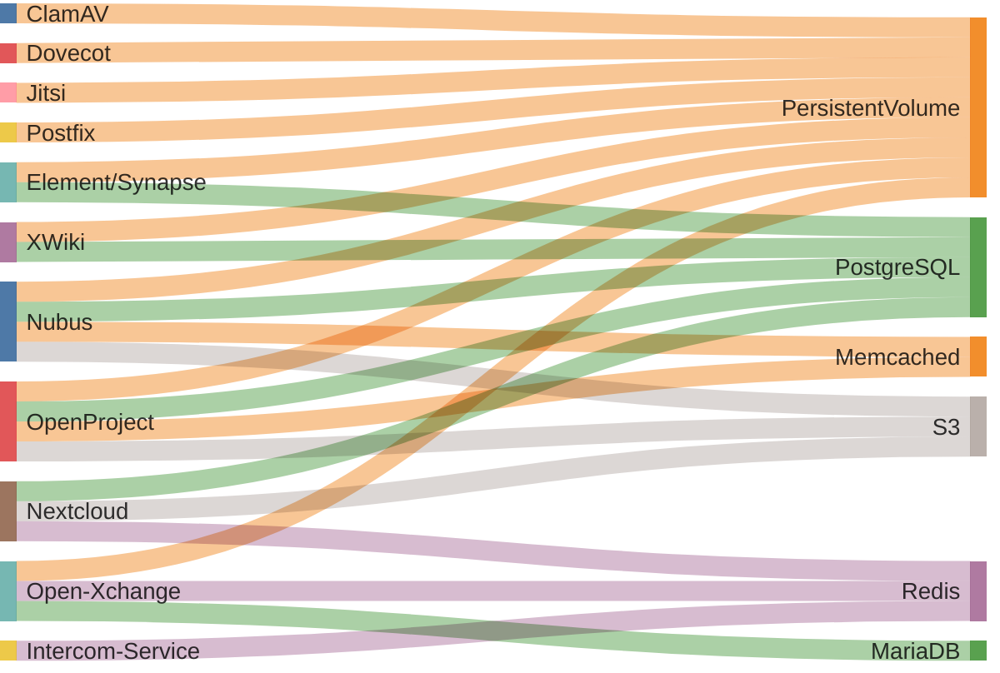

<!--
SPDX-FileCopyrightText: 2024 Zentrum für Digitale Souveränität der Öffentlichen Verwaltung (ZenDiS) GmbH
SPDX-License-Identifier: Apache-2.0
-->

<h1>Application Data Storages</h1>

To provide a feasible backup and restore concept, a thorough overview of all openDesk
applications and their related data storages (ephemeral & persistent) is provided in the
following subsection.

<!-- TOC -->
* [Overview](#overview)
* [Details](#details)
<!-- TOC -->

# Overview

The provided diagram shows all relevant openDesk applications on the left and
their utilized data storages on the right. For more detailed information about each
application refer to the table in [Details](#details).

# Details

| Application          | Data Storage | Backup   | Content                                                                                    | Identifier                                     | Details                                                                                                                  |
|----------------------|--------------|----------|--------------------------------------------------------------------------------------------|------------------------------------------------|--------------------------------------------------------------------------------------------------------------------------|
| **ClamAV**           | PVC          | No       | ClamAV Database                                                                            | `clamav-database-clamav-simple-0`              | `/var/lib/clamav`                                                                                                        |
| **Dovecot**          | PVC          | Yes      | User mail directories (openDesk CE only, openDesk EE uses Dovecot Pro with Object Storage) | `dovecot`                                      | `/srv/mail`                                                                                                              |
| **Element/Synapse**  | PostgreSQL   | Yes      | Application's main database                                                                | `matrix`                                       |                                                                                                                          |
|                      | PVC          | Yes      | Attachments                                                                                | `media-opendesk-synapse-0`                     | `/media`                                                                                                                 |
|                      |              | Yes      | Sync and state data                                                                        | `matrix-neodatefix-bot`                        | `/app/storage`                                                                                                           |
| **Intercom-Service** | Redis        | No       | Shared session data                                                                        |                                                |                                                                                                                          |
| **Jitsi**            | PVC          | Optional | Meeting recordings (feature not enabled in openDesk)                                       | `prosody-data-jitsi-prosody-0`                 | `/config/data`                                                                                                           |
| **Nextcloud**        | PostgreSQL   | Yes      | Application's main database Meta-Data                                                      | `nextcloud`                                    |                                                                                                                          |
|                      | S3           | Yes      | The Nextcloud managed user files                                                           | `nextcloud`                                    |                                                                                                                          |
|                      | Redis        | No       | Distributed caching, as well as transactional file locking                                 |                                                |                                                                                                                          |
| **Nubus**            | PostgreSQL   | Yes      | Main database for Nubus' IdP Keycloak                                                      | `keycloak`                                     |                                                                                                                          |
|                      |              | Yes      | Login actions and device-fingerprints                                                      | `keycloak_extensions`                          |                                                                                                                          |
|                      |              | Optional | Store of the temporary password reset token                                                | `selfservice`                                  |                                                                                                                          |
|                      |              | No       | Notification features are not used in openDesk 1.1                                         | `notificationsapi`                             |                                                                                                                          |
|                      |              | No       | Guardian features are currently not used in openDesk 1.1                                   | `guardianmanagementapi`                        |                                                                                                                          |
|                      | S3           | No       | Static files for Portal                                                                    | `ums`                                          |                                                                                                                          |
|                      | PVC          | Yes      | openLDAP database (primary R/W Pods), when restore select the one from the leader          | `shared-data-ums-ldap-server-primary-0`        | `/var/lib/univention-ldap`                                                                                               |
|                      |              | Yes      | openLDAP process data                                                                      | `shared-run-ums-ldap-server-primary-0`         | `/var/run/slapd`                                                                                                         |
|                      |              | No       | openLDAP database (secondary R/O Pods), secondaries can sync from the primary              | `shared-data-ums-ldap-server-secondary-0`      | `/var/lib/univention-ldap`                                                                                               |
|                      |              | No       | openLDAP process data                                                                      | `shared-run-ums-ldap-server-secondary-0`       | `/var/run/slapd`                                                                                                         |
|                      |              | Yes      | The state of the listener                                                                  | `data-ums-provisioning-udm-listener-0`         | `/var/log/univention` `/var/lib/univention-ldap/schema/id` `/var/lib/univention-directory-listener` |
|                      |              | No       | Cache                                                                                      | `group-membership-cache-ums-portal-consumer-0` | `/usr/share/univention-group-membership-cache/caches`                                                                    |
|                      |              | Yes      | Queued provisioning objects                                                                | `nats-data-ums-provisioning-nats-0`            | `/data`                                                                                                                  |
|                      | Memcached    | No       | Cache for UMC Server                                                                       |                                                |                                                                                                                          |
| **OpenProject**      | PostgreSQL   | Yes      | Application's main database                                                                | `openproject`                                  |                                                                                                                          |
|                      | S3           | Yes      | Attachments, custom styles                                                                 | `openproject`                                  |                                                                                                                          |
|                      | Memcached    | No       | Cache                                                                                      |                                                |                                                                                                                          |
|                      | PVC          | No       | PVC backed `emptyDir` as K8s cannot set the sticky bit on standard emptyDirs               | `openproject-<web/worker>-*-tmp`               | `/tmp`                                                                                                                   |
|                      |              | No       | PVC backed `emptyDir` as K8s cannot set the sticky bit on standard emptyDirs               | `openproject-<web/worker>-app-*-tmp`           | `/app/tmp`                                                                                                               |
| **Open-Xchange**     | MariaDB      | Yes      | Application's control database to coordiate dynamically created ones                       | `configdb`                                     |                                                                                                                          |
|                      |              | Yes      | Dynamically creates databases of schema `PRIMARYDB_n`containing multiple contexts          | `PRIMARYDB_*`                                  |                                                                                                                          |
|                      |              | Yes      | OX Guard related settings                                                                  | `oxguard*`                                     |                                                                                                                          |
|                      | Redis        | Optional | Cache, session related data, distributed maps                                              |                                                |                                                                                                                          |
|                      | PVC          | Yes      | OX-Connector: OXAPI access details                                                         | `ox-connector-appcenter-ox-connector-0`        | `/var/lib/univention-appcenter/apps/ox-connector`                                                                        |
|                      |              | Yes      | OX-Connector: Application's meta data                                                      | `ox-connector-ox-contexts-ox-connector-0`      | `/etc/ox-secrets`                                                                                                        |
| **Postfix**          | PVC          | Yes      | Mail spool                                                                                 | `postfix`                                      | `/var/spool/postfix`                                                                                                     |
| **XWiki**            | PostgreSQL   | Yes      | Application's main database                                                                | `xwiki`                                        |                                                                                                                          |
|                      | PVC          | Yes      | Attachments                                                                                | `xwiki-data-xwiki-0`                           | `/usr/local/xwiki/data`                                                                                                  |

Additionally, the following persistent volumes are mounted by pods that serve as a data storage for the applications mentioned above.

| Service    | Pod              | Volume Name  | PVC                         | MountPath             |
| ---------- | ---------------- | ------------ | --------------------------- | --------------------- |
| MariaDB    | `mariadb-*`      | `data`       | `data-mariadb-0`            | `/var/lib/mysql`      |
| MinIO      | `minio-*-*`      | `data`       | `minio`                     | `/bitnami/minio/data` |
| PostgreSQL | `postgresql-*`   | `data`       | `data-postgresql-0`         | `/mnt/postgresql`     |
| Redis      | `redis-master-*` | `redis-data` | `redis-data-redis-master-0` | `/data`               |
