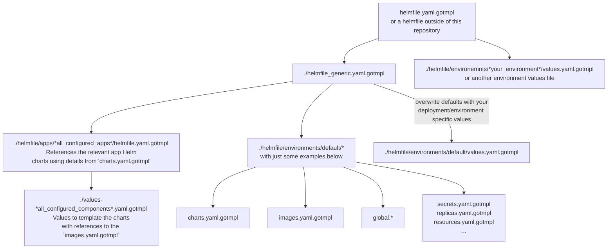

<!--
SPDX-FileCopyrightText: 2024 Bundesministerium des Innern und für Heimat, PG ZenDiS "Projektgruppe für Aufbau ZenDiS"
SPDX-FileCopyrightText: 2024 Zentrum für Digitale Souveränität der Öffentlichen Verwaltung (ZenDiS) GmbH
SPDX-License-Identifier: Apache-2.0
-->

<h1>Developing openDesk deployment automation</h1>

Active development on the deployment is currently only available to project members.
However, contributions are possible using the [CLA](https://gitlab.opencode.de/bmi/opendesk/info/-/blob/main/CONTRIBUTING.md?ref_type=heads) process.

<!-- TOC -->
* [Overview](#overview)
* [Default branch, `develop` and other branches](#default-branch-develop-and-other-branches)
* [External artifacts - `charts.yaml.gotmpl` and `images.yaml.gotmpl`](#external-artifacts---chartsyamlgotmpl-and-imagesyamlgotmpl)
  * [Linting](#linting)
    * [Disable linting selectively](#disable-linting-selectively)
  * [Renovate](#renovate)
  * [Mirroring](#mirroring)
    * [Get new artifacts mirrored](#get-new-artifacts-mirrored)
* [Creating new charts/images](#creating-new-chartsimages)
<!-- TOC -->

# Overview

The following sketch provides a high-level overview to get a basic understanding of the deployment-relevant
structure of this repository. Understanding that structure is vital if you want to contribute to
developing the openDesk platform.



The `helmfile.yaml.gotmpl` file in the root folder is the foundation
for the entire deployment. It references the `helmfile_generic.yaml.gotmpl`
file, which includes app-specific `helmfile.yaml.gotmpl` files and
global values files located in `./environments/default`.

`helmfile.yaml.gotmpl` also refers to three predefined environments: `dev`,
`test`, and `prod`.

The `helmfile_generic.yaml.gotmpl` file is designed to be referenced from
external repositories, where custom environments may be defined. An
example is demonstrated in the `helmfile.yaml.gotmpl` file.

Before you investigate any app-specific configuration, it is recommended that you review the contents of `./helmfile/environments/default` to understand what configuration details are set there, as the app deployments reference them.

# Default branch, `develop` and other branches

The `main` branch is configured to be the default branch, as visitors to the project on openCode should see that
branch by default.

Please use the `develop` branch to diverge your branch(es) from. See the [workflow guide](./docs/developer/workflow.md)
for more details on naming conventions.

# External artifacts - `charts.yaml.gotmpl` and `images.yaml.gotmpl`

The `charts.yaml.gotmpl` and `images.yaml.gotmpl` files are the central place to reference any external artifacts used for the deployment.

Besides the deployment automation itself, some tools work with the contents of the files:

- **Linting**: Ensures consistency of the file contents for the other tools.
- **Renovate**: Automatically create MRs that update the components to their latest version.
- **Mirror**: Mirror artifacts to openCode.

Please find details on these tools below.

## Linting

In the project's CI, there is a step dedicated to lint the two yaml files, as we want them to be in
- alphabetical order regarding the components
- logical order regarding the non-commented lines (registry > repository > tag).

In the linting step, the [openDesk CI CLI](https://gitlab.opencode.de/bmi/opendesk/tooling/opendesk-ci-cli) is used to apply the
aforementioned sorting, and the result is compared with the unsorted version. If there is a delta, the linting fails, and you can fix it by running the CLI tool locally, verifying and applying the result to your branch.

> **Note**<br>
> Please ensure that in component blocks, you use comments only at the beginning of the block or at its end. Ideally, you stick
with the many available examples in the yaml files.

Example:
```yaml
 synapse:
 # providerCategory: "Supplier"
 # providerResponsible: "Element"
 # upstreamRegistry: "https://registry-1.docker.io"
 # upstreamRepository: "matrixdotorg/synapse"
 # upstreamMirrorTagFilterRegEx: '^v(\d+)\.(\d+)\.(\d+)$'
 # upstreamMirrorStartFrom: ["1", "91", "2"]
 registry: "registry.opencode.de"
 repository: "BMI/opendesk/components/supplier/element/images-mirror/synapse"
 tag: "v1.91.2@sha256:1d19508db417bb2b911c8e086bd3dc3b719ee75c6f6194d58af59b4c32b11322"
```

### Disable linting selectively

If you follow the "push early, push often" paradigm to save your work to the central Git instance, or you just fix a typo in
existing documentation, you can avoid the CI and its linting being executed, as it might not offer additional value.

GitLab offers two options to skip the CI on a commit/push:
- Add `[ci skip]` to your commit message ([details](https://docs.gitlab.com/ee/ci/pipelines/#skip-a-pipeline)).
**Note:** The string has to be removed before merging your feature branch into `develop`.
- Use the related git push option `git push -o ci.skip` ([details](https://docs.gitlab.com/ee/user/project/push_options.html#push-options-for-gitlab-cicd)).

## Renovate

Uses a regular expression to match the values of the following attributes:

- `# upstreamRegistry` *required*: Attribute's value must be prefixed with `https://` for Renovate.
- `# upstreamRepository` *required*
- `tag` *required*

Checks for newer versions of the given artifact and creates an MR containing the newest version's tag (and digest).

## Mirroring

- See also: https://gitlab.opencode.de/bmi/opendesk/tooling/oci-pull-mirror

> **Note:**<br>
> The mirror is scheduled to run every hour at 42 minutes past the hour.

openDesk strives to make all relevant artifacts available on openCode so there is a mirroring process
configured to pull artifacts that do not originate from openCode into projects called `*-Mirror` within the
[openDesk Components section](https://gitlab.opencode.de/bmi/opendesk/components).

The mirror script takes the information on what artifacts to mirror from the annotation inside the two yaml files:
- `# upstreamRegistry` *required*: To identify the source registry
- `# upstreamRegistryCredentialId`: *optional*: In case the source registry is not public, the access credentials have to be specified as environment variables and contain the value of this key in their name, so you want to specify the key in uppercase:
  - `MIRROR_CREDENTIALS_SRC_<upstreamRegistryCredentialId>_USERNAME`
  - `MIRROR_CREDENTIALS_SRC_<upstreamRegistryCredentialId>_PASSWORD`
- `# upstreamRepository` *required*: To identify the source repository
- `# upstreamMirrorTagFilterRegEx` *required*: If this annotation is set, the mirror for the component will be activated. Only tags that match the given regular expression will be mirrored. **Note:** You must use single quotes for this attribute's value if you use backslash leading regex notation like `\d`.
- `# upstreamMirrorStartFrom` *optional*: Array of numeric values in case you want to mirror only artifacts beginning with a specific version. You must use capturing group
 in `# upstreamMirrorTagFilterRegEx` to identify the single numeric elements of the version within the tag and use per capturing group (left to right) one numeric array
 element here to define the version the mirror should start with.

### Get new artifacts mirrored

If you want new images or charts mirrored that are not yet included in one of the yaml files, you can add them in your branch, including the aforementioned mirror annotations, and ask somebody from the platform development team to trigger the mirror's CI based on your branch.

Once your branch is merged into develop, your artifacts are mirrored hourly.

# Creating new charts/images

When you create new Helm charts, please check out the
[openDesk Best Practices](https://gitlab.opencode.de/bmi/opendesk/components/platform-development/charts/opendesk-best-practises)
for Helm charts.

You may also want to make use of our [standard CI](https://gitlab.opencode.de/bmi/opendesk/tooling/gitlab-config) to
quickly get Helm charts and container images that are signed, linted, scanned, and released.
Check out the `.gitlab-ci.yaml` files in the project's [Charts](https://gitlab.opencode.de/bmi/opendesk/components/platform-development/charts) or [Images](https://gitlab.opencode.de/bmi/opendesk/components/platform-development/images) to get an idea just how little you need to do by yourself.
