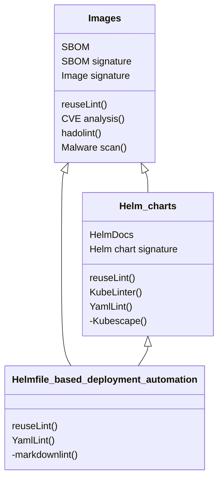
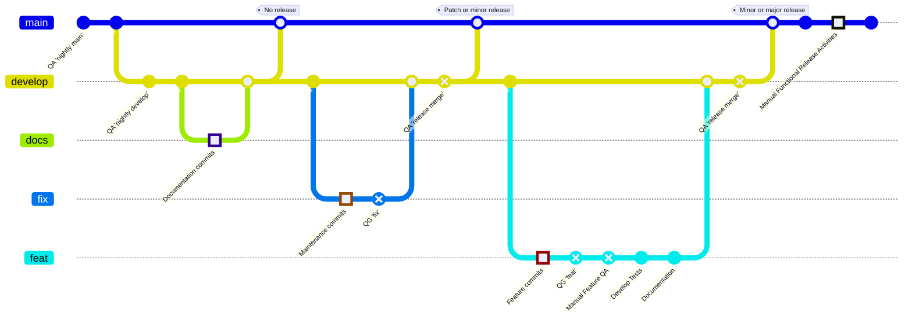
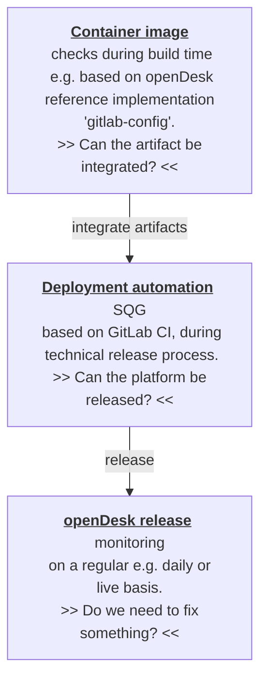

<!--
SPDX-FileCopyrightText: 2023 Bundesministerium des Innern und für Heimat, PG ZenDiS "Projektgruppe für Aufbau ZenDiS"
SPDX-FileCopyrightText: 2024 Zentrum für Digitale Souveränität der Öffentlichen Verwaltung (ZenDiS) GmbH
SPDX-License-Identifier: Apache-2.0
-->

<h1>Technical development and release workflow</h1>

<!-- TOC -->
* [Scope](#scope)
* [Roles and responsibilities](#roles-and-responsibilities)
* [Deployment automation](#deployment-automation)
  * [openDesk technical component classes](#opendesk-technical-component-classes)
  * [Functional vs. service components](#functional-vs-service-components)
  * [Origins](#origins)
  * [Reference CI for creating Images and Helm charts (gitlab-config)](#reference-ci-for-creating-images-and-helm-charts-gitlab-config)
  * [Licensing](#licensing)
  * [Development workflow](#development-workflow)
    * [Disclaimer](#disclaimer)
    * [Workflow](#workflow)
      * [Branching concept](#branching-concept)
      * [Standard Quality Gate (SQG)](#standard-quality-gate-sqg)
      * [Branch workflows](#branch-workflows)
        * [`main`](#main)
        * [`develop`](#develop)
        * [`docs`](#docs)
        * [`fix`](#fix)
        * [`feat`](#feat)
      * [Branch names](#branch-names)
      * [Commit messages / Conventional Commits](#commit-messages--conventional-commits)
      * [Verified commits](#verified-commits)
* [Footnotes](#footnotes)
<!-- TOC -->

# Scope

This document covers the development of a technical release, thereby addressing:
- the development and branching concept for the openDesk deployment automation
- the related quality gates
- the creation of technical releases

It does not cover additional artifacts that might be related to a functional release.

# Roles and responsibilities

The following section provides a high-level view of the involved parties in the openDesk context and their responsibilities:

- **Open source product suppliers**
  - Focus areas
    - Development of upstream products
    - Development of integrative functionality relevant to openDesk and others
    - Providing source code and the artifacts required to install openDesk to openCode
  - Hand over to _openDesk platform development_
    - Helm charts
    - Container images
    - Documentation
- **openDesk platform development**
  - Focus areas
    - Integration of the supplier's artifacts, addressing basic operational needs
    - Implementation of services required (e.g. persistence layer) to develop and test openDesk
    - Implementation of the required quality gates (QG)
    - Ensuring the quality gates are passed
  - Hand over to _Operator_
    - Deployment automation
- **Operator**
  - Focus areas
    - Provide production-grade services (e.g. persistence layer) to operate openDesk
    - Rollout, operate, and support openDesk
    - Further develop the deployment automation to meet extended operational requirements, ideally providing these developments upstream to the openDesk platform development in order to have them included as standard in the future.
  - The operator can either use a self-operated Kubernetes cluster to deploy openDesk or make use of a managed Kubernetes offering from a **Cloud Provider**

# Deployment automation

The openDesk deployment automation is the core outcome of the platform development process.

The openDesk platform development team created and maintains the deployment automation, which allows interested parties to deploy openDesk onto their cloud infrastructure with a low barrier to entry. The core technology for the automation is [Helm](https://helm.sh/), which is orchestrated using [Helmfile](https://github.com/helmfile/helmfile). Of course, this deployment is also used by the suppliers and the platform team in everyday work.

Please find the deployment automation, including its documentation, in the following project: https://gitlab.opencode.de/bmi/opendesk/deployment/opendesk

The automation supports Gitlab CI/CD, local execution, and triggering the Helmfile deployment for the whole platform or single applications.

## openDesk technical component classes

The below rendering in [class diagram](https://en.wikipedia.org/wiki/Class_diagram) notation shows the three component classes openDesk consists of. In each of these:
- the first section below the name of the class shows the required **characteristics** of each component of the given class
- the second section shows the **methods** like linting that must be applied to that class's artifacts

> **Note**<br>
> The methods prefixed with '-' are not yet available in `gitlab-config`. You will learn about them later.



## Functional vs. service components

The focus of openDesk is to provide an integrated and functional productivity platform based on the involved suppliers' functional components (products). These functional components usually rely on specific service components, e.g. database services for persistence. When running openDesk in production, the operator is responsible for providing these production-grade services. For evaluation and development purposes, the openDesk deployment automation includes these services.

Find the list of functional and service components in the [archictecture documentation](./docs/architecture.md).

## Origins

The openDesk platform consolidates the technical components from various origins:

1) *Supplier* for functional components: Provide their upstream product, sometimes including openDesk-specific builds or extensions and product deployment (Helm charts).
2) *Third-party upstream* for service components: The platform development team tries to use as many community upstream components as possible for the services they have to provide within openDesk.
3) *Platform development* filling the gap: Some suppliers might not provide Helm charts or images for their products that fit the needs of openDesk, and some third-party upstream components are not built to fit into openDesk. In such cases, the platform development team creates its own Helm charts and images.

## Reference CI for creating Images and Helm charts (gitlab-config)

As mentioned in the chapter "Origins" above, the openDesk platform development also creates images and Helm charts when needed.

For that purpose openDesk provides a [GitLab CI-based reference implementation](https://gitlab.opencode.de/bmi/souveraener_arbeitsplatz/tooling/gitlab-config) called `gitlab-config` to achieve the required characteristics and apply the necessary methods including releasing the artifacts based on [Semantic Release](https://github.com/semantic-release/semantic-release#readme) into the GitLab container registry.

## Licensing

As a standard, the openDesk platform development team uses [reuse.software](https://reuse.software/) wherever possible to annotate license and copyright information.

openDesk uses Apache 2.0 as the license for their work. A typical reuse copyright and license header looks like this:
```
# SPDX-FileCopyrightText: 2025 Zentrum für Digitale Souveränität der Öffentlichen Verwaltung (ZenDiS) GmbH
# SPDX-License-Identifier: Apache-2.0
```
The way to mark the license header as a comment differs between the various file types. Please find matching examples for all types across the [deployment automation repository](https://gitlab.opencode.de/bmi/opendesk/deployment/opendesk).

> **Note**<br>
> If a `SPDX-FileCopyrightText` already exists with the copyright owner described above but with a past year (e.g. 2024), please update this copyright header line to cover (up to and including) the current year, e.g. `2024-2025`.

> **Note**<br>
> If line(s) with `SPDX-FileCopyrightText` containing a different copyright owner exist in the file you are working on, do not replace existing one(s), but rather add another header above these.

## Development workflow

### Disclaimer

openDesk consists only of community products, so there is no SLA related to service updates or backport of critical security fixes. This has two consequences:
- In production scenarios, you should replace the community versions of the functional components with supported, SLA-backed paid versions.
- openDesk aims to update to the community components' latest available releases continually; therefore, we have rolling technical releases.

### Workflow

This chapter describes the deployment automation's development workflow. The suppliers have their own development processes and workflows. While we aim to always update to the most recent community version(s) available, openDesk also sponsors the development done by the suppliers. As the openDesk team has to take a closer look at these sponsored features, they are referred to as *supplier deliverables* within the platform development workflow.

#### Branching concept

The picture below uses Gitflow notation to give an overview of the different types of development flows.

The basic facts for the flow are:
- When the `develop` branch is merged into `main`, a technical release is created (except when the merge commit(s) are of type `chore` or `docs`).
- Changes that will be applied to openDesk have to branch off from `develop`; we call these branches *feature* branches.
  - Developers can create sub-branches from their feature branch(es) as needed.
- When a *feature* branch gets pushed a Merge Request in `Draft` state is automatically created.
- We know three types of *feature* branches:
  - `docs`: Includes only documentation changes.
  - `fix`: Maintenance of the openDesk software components and minor configurational changes.
  - `feat`: All changes that do not fall into the two categories above, especially:
    - supplier deliverables
    - configuration changes that have a significant impact on openDesk users or require migrations
- The *QG* entries in the workflow refer to quality gates that are explained in more detail later.
- All merges into `develop` or `main` require two approvals from the platform development team[^1]. Those approving must ensure that the defined quality gates have been successfully passed.



#### Standard Quality Gate (SQG)

The Standard Quality Gate addresses quality assurance steps that should be executed within each of the mentioned quality gates in the workflow.

1. Linting
   - Blocking
     - Licensing: [reuse](https://github.com/fsfe/reuse-tool)
     - openDesk specific: Especially `images.yaml.gotmpl` and `charts.yaml.gotmpl`, find more details in [development.md](./docs/developer/development.md).
   - Non-Blocking
     - Security: [Kyverno policy check](../.kyverno) addressing some IT-Grundschutz requirements
     - Formal: Yaml
2. Deploy the full openDesk stack from scratch:
   - All deployment steps must be successful (green)
   - All tests from the end-to-end test set must be successful
3. Update deployment of the full openDesk stack and apply the quality measures from the step #1:
   - Deploy the current merge target baseline (`develop` or `main`)
   - Update deploy from your QA branch into the instance from the previous step
4. No showstopper found regarding:
   - SBOM compliance[^2]
   - Malware check
   - CVE check[^3]
   - Kubescape scan[^3]

Steps #1 to #3 from above are executed as GitLab CI and documented within GitLab.

Step #4 is focused on security and has not been fully implemented yet. Its main objective is to check for regressions. That step is just the second step of a security check and monitoring chain, as shown below. While some checks can be executed against static artifacts (e.g., container images), others might require an up-and-running instance. These are specifically located in the third step below, which has not yet been implemented.



#### Branch workflows

This section will explain the workflow for each branch type based on the Gitflow picture from above.

##### `main`

- `QA 'nightly main'`: Execute the SQG based on the most recent release. The upgrade test environment should be a long-standing environment that only gets built from scratch with the previous technical release when something breaks the environment.
Merge points: We are using the [Semantic Release convention](https://github.com/semantic-release/semantic-release), which is based on the [Semantic Versioning (SemVer) notation](https://semver.org), to automatically create technical releases on the merge points.
  - "No release": When a merge from `develop` includes only changes from `docs` branches, the merge into `main` will only consist of `docs` or `chore` commits. That merge will generate no new release.
  - "Patch or minor release": When changes from `fix` branches get merged, these might contain `fix` or `feat` commits, causing a new technical release to be built with an updated version on the Patch or Minor level.
  - "Minor or major release": When changes from `feat` branches get merged, these might contain `feat` commits even with breaking changes, causing a technical release to be built with an updated version on the Minor or Major level.
- "Manual Functional Release Activities": Technical releases are loosely coupled to functional releases. The additional activities for a functional release select an existing technical release as a basis to generate the artifacts required for a functional release, for example:
  - Conduct additional manual explorative and regression tests.
  - Perform checks like IT Grundschutz, Accessibility, or Data Protection.

##### `develop`

- `QA 'nightly develop'`: Follows the same approach as `QA 'nightly main'` - execute the SQG based on the head revision of the `develop` branch.
- `QA 'release merge'`: The Merge Request for this merge has to be created manually by members of the platform development team. It should document:
  - That the SQG was successfully executed upon the to-be merged state - it could be done explicitly or based on a `QA 'nightly develop'`
  - In case of `fix` changes that usually have no test automation, Changes have been verified by a member of the platform development team.
  - That the changes have been reviewed by at least two members of the platform development team, giving their approval on the Merge Request.
- Merge points (from `docs`, `fix`, and `feat` branches): No additional activity on these merge points as the QA is ensured before the merge in the aforementioned branch types.

##### `docs`

Branches of type `docs` only contain the commits themselves and have to adhere to the workflow basic fact that: All merges into `develop` or `main` require two approvals from the platform development team.

##### `fix`

Besides the actual changes being committed in an `fix` branch, there is only the:
- `QG 'fix'`: Besides validating the actual change, the branch's owner has to ensure the successful execution of the SQG.

##### `feat`

This branch type requires the most activities on top of the actual development:
- `QG 'feat'`: The branch owner has to validate the implemented functionality and ensure the SQG is passed successfully.
- `Manual Feature QA`:
  - This is the interface between the platform development workflow and the supplier work package workflow.
  - The openDesk QA team validates the change, ideally based on the acceptance criteria defined in the supplier's work package definition.
    - QA passes on the feedback to the developer/supplier if improvements are needed.
    - Test cases for the feature's test automation are defined if the QA was successful.
    - QA should also evaluate if there is a need for end-user documentation of the feature.
- `Develop Test`: The test cases are implemented by the openDesk platform development and added to the openDesk end-to-end test suite.
- `Documentation`: When required, the documentation team has to update the end-user documentation.

#### Branch names

Branches created from the `develop` branch have to adhere to the following notation: `<responsible_developer>/<type>_<details>`:

- `<responsible_developer>`: Something that makes you identifiable as the owner of the branch, e.g. the first letter of your first name followed by your family name.
- `<type>`: From the list of branch types explained above:
  - `docs`
  - `fix`
  - `feat`
- `<details>`: A very short note about what is going to happen in the branch and ideally what component is affected from the following list of components:
  - `helmfile`
  - `ci`
  - `docs`
  - `collabora`
  - `cryptpad`
  - `element`
  - `jitsi`
  - `nextcloud`
  - `nubus`
  - `open-xchange`
  - `openproject`
  - `services`
  - `xwiki`

Example: `tmueller/fix_jitsi_theming`.

> **Note**<br>
> The above naming convention has yet to be enforced, but please ensure you use it.

#### Commit messages / Conventional Commits

Commit messages must adhere to the [Conventional Commit standard](https://www.conventionalcommits.org/en/v1.0.0/#summary). Commits that do not adhere to the standard get rejected by either [Gitlab push rules](https://docs.gitlab.com/ee/user/project/repository/push_rules.html) or the CI.

```text
<type>(<scope>): [path/to/issue#1] <short summary>.
 │       │              │                │
 │       │              |                └─> Summary in present tense, sentence case, with no period at the end
 │       │              |
 │       │              └─> Issue reference (optional)
 │       │
 │       └─> Commit Scope: helmfile, docs, collabora, nextcloud, open-xchange, etc.
 │
 └─> Commit Type: chore, ci, docs, feat, fix
```

Example: `fix(open-xchange): Bump to 8.26 to heal issue with functional mailbox provisioning.`

> **Note**<br>
> The commit messages are an essential part of the [technical releases](https://gitlab.opencode.de/bmi/opendesk/deployment/opendesk/-/releases) as the release's notes are generated from the messages.

#### Verified commits

We only allow verified commits; please read on about the options you have to make your commits verified:
- https://docs.gitlab.com/user/project/repository/signed_commits/ssh/
- https://docs.gitlab.com/user/project/repository/signed_commits/gpg/
- https://docs.gitlab.com/user/project/repository/signed_commits/x509/

# Footnotes

[^1]: These approval rules are not available in the GitLab Free Tier, which is one of the main reasons why deployment automation is not developed on openCode.

[^2]: The SBOM process is executed asynchronously with the development process and tests the most current technical release from the `main` branch. The process still needs to be fully automated.

[^3]: The quality gate needs to be implemented primarily when identifying regressions.
